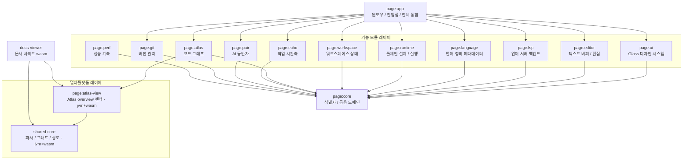

# PAGE IDE

> English: [README_en.md](https://monkshark.github.io/page-ide/#README_en.md)

[](https://github.com/monkshark/page-ide/actions/workflows/ci.yml)


> 다언어 데스크톱 IDE — **P**air · **A**tlas · **G**lass · **E**cho

**PAGE 는 Kotlin 과 Compose Multiplatform Desktop 으로 처음부터 작성한 다언어 데스크톱 IDE 입니다.** 현재 24개 언어에 대한 LSP 기반 자동완성·진단, 13개 언어의 단일 파일 실행, 언어 서버·툴체인의 IDE 내 자동 설치를 제공합니다. 기능은 16개 모듈로 분리되며 의존성은 항상 단방향으로 강제됩니다. 코드(텍스트)·코드 그래프(공간)·작업 시간축(시간)·AI 동반자(대화) 네 차원을 하나의 워크스페이스에 통합하는 것을 목표로 합니다.

[개발 블로그](https://monkshark.github.io/categories/page-개발기/)

## 문서 허브

- [PAGE 개요](https://monkshark.github.io/page-ide/#guides/overview.md) — 핵심 가치 정의, 만들지 *않을* 것
- [아키텍처 가이드](https://monkshark.github.io/page-ide/#guides/architecture.md) — 모듈 설계 원칙, 의존성 격리 전략, 기술 스택 결정 근거
- [전체 목차](https://monkshark.github.io/page-ide/) — 공식 문서 사이트 진입점

## 동작하는 기능

본 프로젝트는 pre-alpha 단계이며, 아래 기능들이 실제로 동작합니다.

| 기능 | 지원 범위 | 상세 |
|---|---|---|
| **다언어 LSP 라우팅** | 24개 언어 | 활성 파일의 확장자를 감지해 적합한 언어 서버를 자동 선택합니다. (자동완성, 진단, 정의 이동, 호버) |
| **단일 파일 실행 (Run)** | 13개 언어 | 별도 프로젝트 구성 없이 Python·Node·TypeScript·Kotlin·Java·Go·C/C++·Rust·C#·Bash·Dart·Swift 파일을 실행합니다. |
| **런타임·툴체인 자동 설치** | 10여 종 | 언어 서버나 실행기가 없으면 IDE 안에서 내려받아 설치합니다. 진행률은 상태바에 표시되며 백그라운드로 이어집니다. |
| **에디터** | 공통 | 멀티탭·분할 뷰, 자동 들여쓰기, 괄호 매칭, 컨텍스트 메뉴, 일괄 치환, 자동저장, 워크스페이스 영속화. |

지원 언어: Kotlin, Java, Python, TypeScript/JavaScript, Go, Rust, C/C++, Swift, Dart/Flutter, Ruby, PHP, Vue, Svelte, JSON, YAML, HTML, CSS, SQL, Markdown, Dockerfile.

자동 설치 대상: JDK · Node · Python · Go · Rust · .NET SDK · Dart/Flutter · Swift · LLVM/Clang · MinGW-w64 · Windows SDK(MSVC, xwin).

## 핵심 가치

PAGE 가 지향하는 네 가지 설계 축입니다. Atlas 는 동작하며(import·호출·모듈 그래프), Glass 는 부분 구현입니다. Pair 와 Echo 는 아직 설계·초기 구현 단계로, 아래 표는 각 기둥의 목표 모습을 함께 설명합니다.

| 기둥 | 의미 |
|---|---|
| **Pair** | 개발자의 맥락을 관찰하고 대화하는 AI 동반자 — 관찰자 / 대화 / 에이전트 / 튜터 |
| **Atlas** | 모듈·함수·의존성을 노드와 엣지로 시각화하는 코드 그래프 |
| **Glass** | 다크 우선 글래스모피즘 디자인 시스템 — 부드러운 모션, 포커스 모드 |
| **Echo** | 키스트로크와 변경 이벤트를 로컬에 영속화하는 작업 시간축 |

상세 시나리오는 [overview.md](https://monkshark.github.io/page-ide/#guides/overview.md#핵심-가치-네-가지) 를 참조하십시오.

## 아키텍처

기능을 모듈로 나누고, 의존성은 언제나 단방향으로만 흐르도록 강제합니다. 최하단의 `core` 모듈은 외부 라이브러리 의존성이 전혀 없는 순수 Kotlin 으로 작성되어 모든 모듈의 토대가 됩니다.



### 디렉토리 구조

```
.
├── page/
│   ├── core/        식별자·공용 도메인 모델 (외부 의존 없는 순수 Kotlin)
│   ├── perf/        성능 계측
│   ├── ui/          Glass 디자인 시스템 (Material 3 + 디자인 토큰)
│   ├── editor/      텍스트 버퍼 제어 및 편집 로직
│   ├── lsp/         언어 서버 백엔드 (LSP4J 기반 JSON-RPC, 다중 인스턴스 라우팅)
│   ├── language/    언어 정의 메타데이터 (라우팅·프로파일)
│   ├── runtime/     언어별 툴체인 설치 및 단일 파일 컴파일/실행
│   ├── workspace/   워크스페이스 상태 관리 및 영속화
│   ├── atlas/       코드 그래프 (import·호출·모듈 뷰)
│   ├── atlas-view/  Atlas overview 렌더 — 멀티플랫폼 (jvm + wasmJs)
│   ├── echo/        작업 시간축 (스캐폴딩)
│   ├── pair/        AI 동반자 (스캐폴딩)
│   ├── git/         버전 관리 연동
│   └── app/         윈도우·진입점·전체 모듈 통합 (Main)
├── shared-core/    파서·그래프·경로 공용 코드 — 멀티플랫폼 (jvm + wasmJs)
└── docs-viewer/    문서 사이트 (Compose wasm)
```

- 단방향 의존: `app → 기능 모듈 → core`
- 멀티플랫폼: `docs-viewer → atlas-view → shared-core` (jvm + wasmJs 공용, `java.*` 미사용)
- `core` 는 외부 라이브러리 의존 없음 (순수 Kotlin)

설계 결정 근거는 [architecture.md](https://monkshark.github.io/page-ide/#guides/architecture.md) 에 정리되어 있습니다.

## 주요 엔지니어링 과제

기능을 추가하며 마주한 대표적인 과제를 문제와 해결 방식 중심으로 정리합니다.

### 1. LSP 다언어 라우팅

- **문제**: 초기 설계는 `LspController` 가 단일 언어 서버(Kotlin)에 강결합되어, 다른 확장자 파일에서는 자동완성·진단이 동작하지 않았습니다.
- **해결**: 파일 확장자에 따라 언어 서버 인스턴스로 분기하는 중앙 라우팅 계층을 도입했습니다. `LanguageDefinition` 메타데이터로 언어별 차이를 추상화해, 코드 변경을 최소화하면서 24개 언어의 자동완성 경로를 일원화했습니다.

### 2. Windows 환경의 Swift 단일 파일 실행

- **문제**: 기존 tar 파서가 ustar 100바이트 이름 한계만 처리해, GNU `@LongLink`·PAX 확장 헤더로 기록된 긴 경로(swiftmodule)가 추출 과정에서 잘렸습니다. 또한 Windows 에서 `import Foundation` 코드가 빌드·링크되지 않았습니다.
- **해결**: GNU `@LongLink`·PAX 확장 헤더를 처리하는 tar 추출기로 교체해 경로 잘림을 제거했습니다. Windows SDK(MSVC, xwin) 헤더·라이브러리와 Foundation import 라이브러리를 `swiftc` 링크 단계에 연결했고, 자식 프로세스 환경의 `Path`/`PATH` 대소문자 중복 키를 정규화해 언어 런타임의 환경 변수 충돌 가능성을 차단했습니다.

### 3. 증분 빌드 캐시

- **문제**: 컴파일 언어는 소스가 바뀌지 않아도 실행할 때마다 재컴파일해 대기 시간이 발생했습니다.
- **해결**: 출력물과 입력 소스의 수정 시각, 빌드 명령 동일성을 비교해 변경이 없으면 재빌드를 건너뛰는 캐시를 구현했습니다. 측정 환경(로컬 Windows)에서 Swift 단일 파일은 첫 실행이 약 10초(모듈 캐시 빌드 포함)였고, 모듈 캐시 구성 후 재실행은 약 2.5초였으며, 캐시 적중 시 컴파일 단계를 생략합니다.

### 4. 도메인 로직과 UI 결합도 분리

- **문제**: 최상위 통합 모듈(`app`)에 편집 상태와 UI 컴포저블이 함께 누적되어 결합도가 높고 프롭 드릴링이 심화되었습니다.
- **해결**: 편집·워크스페이스 상태를 전용 상태 홀더로 이관해 책임을 격리하고, 불필요한 콜백 프롭 전달을 축소했습니다. 레이아웃 컴포저블을 별도 파일로 분리해 가독성과 단위 테스트 용이성을 확보했습니다.

### 5. Kotlin 언어 서버 콜드 스타트 단축

- **문제**: PAGE 의 primary 언어인 Kotlin 의 LSP(KLS) 가 멀티모듈 워크스페이스에서 콜드 스타트에 약 145초가 걸렸습니다. 워크스페이스의 빌드 파일마다 별도 resolver 가 생겨, 15개 안팎의 서브모듈에 대해 `gradlew kotlinLSPProjectDeps` 류의 Gradle CLI 호출을 모듈 수만큼 순차로 수행한 것이 주된 원인이었습니다.
- **해결**: KLS init script 가 의존성 추출 task 를 `allprojects` 에 등록한다는 점을 이용해, 단일 루트 빌드(루트에 settings 가 있고 중첩 settings 가 없는 경우)에서는 루트 한 번의 해석으로 전 서브모듈 classpath 를 가져오도록 바꿨습니다. 더불어 Gradle 경로에서 소스 jar 없이 중복으로 돌던 두 번째 classpath 해석을 `providesSources` 게이트로 건너뜁니다. 측정 환경(로컬 Windows, PAGE 자체 워크스페이스)에서 콜드 스타트가 약 145초에서 약 40초로 줄었고(약 72% 단축), 해석된 classpath(104개 jar)는 동일합니다.

## 기술 스택

| 분류 | 기술 |
|------|------|
| **Language** | Kotlin 2.1.20 (JDK 21 toolchain, Foojay 자동 프로비저닝) |
| **UI** | Compose Multiplatform 1.7.3 — Desktop 단독 진입 |
| **Theme** | Material 3 + Glass 디자인 토큰 (다크 우선) |
| **LSP** | LSP4J 기반 JSON-RPC, 언어 서버 다중 인스턴스 라우팅 |
| **Build** | Gradle 8.14 + version catalog (`gradle/libs.versions.toml`) |
| **Daemon JVM** | `gradle/gradle-daemon-jvm.properties` (toolchainVersion=21, vendor=ADOPTIUM) |
| **CI** | GitHub Actions — ubuntu-latest + Temurin 21 + `./gradlew build` |

## 빌드 / 실행

JDK 는 Gradle toolchain 이 자동 프로비저닝하므로, 별도 설치 없이 래퍼 스크립트만으로 빌드됩니다.

```bash
# 애플리케이션 실행
./gradlew :page:app:run

# 전체 모듈 빌드 + 테스트
./gradlew build

# 특정 모듈 단위 테스트
./gradlew :page:runtime:test
```

## 컨트리뷰션 / 워크플로우

- **main 브런치 보호**: 직접 푸시를 금지합니다. 모든 변경은 feature 브런치 → PR → CI 통과 → squash 머지 순서로 반영합니다.
- **CI 게이트**: ubuntu-latest + Temurin 21 + `./gradlew build`. 빌드가 통과해야 머지됩니다.
- **테스트 정책**: 실제 동작 코드를 다루는 기능에는 단위 테스트를 동반합니다. 골격/스캐폴딩은 면제합니다.

## 라이선스

> 미정 — pre-alpha 단계.

## Contact

- 버그 / 기능 제안: [GitHub Issues](https://github.com/monkshark/page-ide/issues)
- 개발기 (한국어 블로그): <https://monkshark.github.io/categories/page-개발기/>
- 이메일: justinchoo0814@gmail.com
