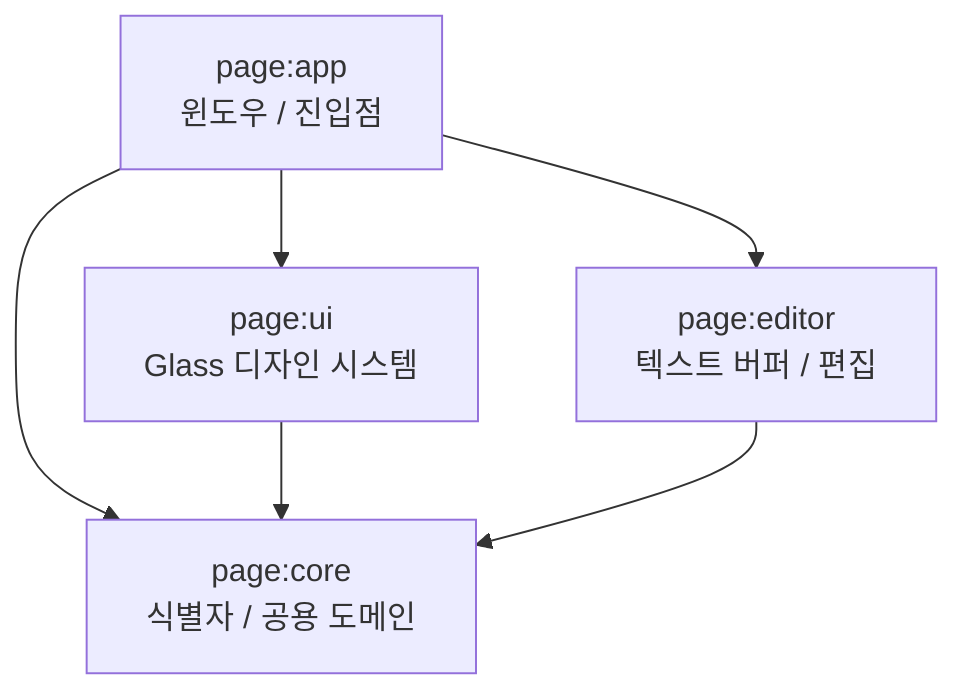

# PAGE IDE

> English: [README_en.md](https://monkshark.github.io/PAGE_IDE/#README_en.md)

> 다언어 데스크톱 IDE — **P**air · **A**tlas · **G**lass · **E**cho

PAGE는 한 페이지 안에서 네 가지 차원을 동시에 본다. 코드(텍스트), 코드 그래프(공간), 작업 시간축(시간), AI 동반자(대화). 기존 IDE 가 이 중 하나만 잘 푸는 동안, PAGE 는 이 넷을 한 화면 안에 통합한다. Kotlin + Compose Multiplatform Desktop 으로 처음부터 새로 만든다.

[개발 블로그](https://monkshark.github.io/categories/page-개발기/)

## 문서 허브

- [PAGE 개요](https://monkshark.github.io/PAGE_IDE/#guides/overview.md) — 핵심 가치 네 가지, 만들지 *않을* 것
- [아키텍처](https://monkshark.github.io/PAGE_IDE/#guides/architecture.md) — 모듈 경계, 의존 방향, 기술 스택 결정
- [전체 목차](https://monkshark.github.io/PAGE_IDE/) — docs 사이트 진입점

## 핵심 가치

| 기둥 | 의미 |
|---|---|
| **Pair** | 곁에서 코드를 함께 보는 AI 동반자 — 관찰자 / 대화 / 에이전트 / 튜터 |
| **Atlas** | 모듈·함수·의존성을 노드와 엣지로 보여주는 코드 그래프 |
| **Glass** | 글래스모피즘 기반 디자인 시스템 — 다크 우선, 부드러운 모션, 포커스 모드 |
| **Echo** | 키스트로크를 로컬 SQLite 에 저장하는 작업 시간축 |

각 기둥의 상세 시나리오는 [overview.md](https://monkshark.github.io/PAGE_IDE/#guides/overview.md#핵심-가치-네-가지).

## 아키텍처 요약

- 단방향 의존: `app → {ui, editor} → core`
- `core` 는 외부 라이브러리 의존 없음 (순수 Kotlin)

전체 아키텍처와 결정 근거는 [architecture.md](https://monkshark.github.io/PAGE_IDE/#guides/architecture.md).

## 기술 스택

| 분류 | 기술 |
|------|------|
| **Language** | Kotlin 2.1.20 (JDK 21 toolchain, Foojay 자동 프로비저닝) |
| **UI** | Compose Multiplatform 1.7.3 — Desktop 단독 진입 |
| **Theme** | Material 3 + Glass 디자인 토큰 (다크 우선) |
| **Build** | Gradle 8.14 + version catalog (`gradle/libs.versions.toml`) |
| **Daemon JVM** | `gradle/gradle-daemon-jvm.properties` (toolchainVersion=21, vendor=ADOPTIUM) |
| **CI** | GitHub Actions — ubuntu-latest + Temurin 21 + `./gradlew build` |

## 컨트리뷰션 / 워크플로우

- **main 브런치 보호**: 직접 푸시 금지. 모든 변경은 feature 브런치 → PR → CI 통과 → squash 머지.
- **CI**: ubuntu-latest + Temurin 21 + `./gradlew build`. PR 머지 게이트.
- **테스트 정책**: 큰 기능 (실 동작 코드) 작업 시 단위 테스트 동반. 골격/스캐폴딩은 면제.

## 라이선스

> 미정.

## Contact

- 버그 / 기능 제안: [GitHub Issues](https://github.com/Monkshark/PAGE_IDE/issues)
- 개발기 (한국어 블로그): <https://monkshark.github.io/categories/page-개발기/>
- 이메일: justinchoo0814@gmail.com
