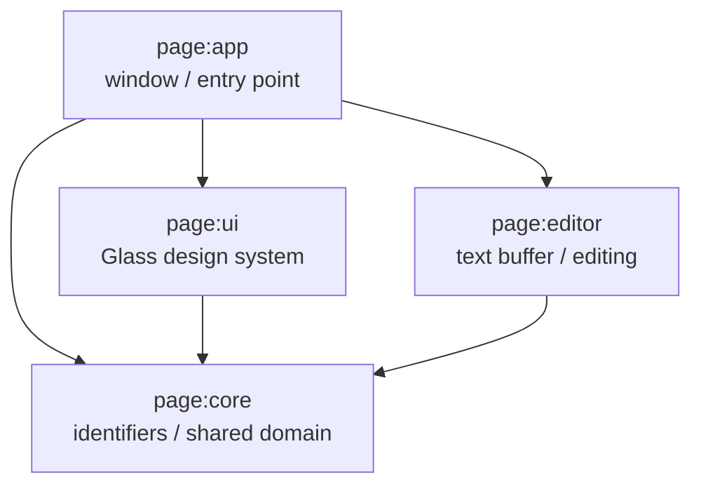

# PAGE IDE

> 한국어: [README.md](https://monkshark.github.io/PAGE_IDE/#README.md)

> Multi-language desktop IDE — **P**air · **A**tlas · **G**lass · **E**cho

PAGE shows four dimensions on a single page at the same time: code (text), code graph (space), work timeline (time), AI companion (conversation). While existing IDEs solve only one of these well, PAGE integrates all four into one screen. Built from scratch with Kotlin + Compose Multiplatform Desktop.

[Devlog (Korean)](https://monkshark.github.io/categories/page-개발기/)

## Documentation hub

- [PAGE overview](https://monkshark.github.io/PAGE_IDE/#guides/overview_en.md) — The four core values, what we will *not* build
- [Architecture](https://monkshark.github.io/PAGE_IDE/#guides/architecture_en.md) — Module boundaries, dependency direction, stack choices
- [Docs index](https://monkshark.github.io/PAGE_IDE/) — docs site entry point

## Core values

| Pillar | Meaning |
|---|---|
| **Pair** | An AI companion that reads code alongside you — observer / chat / agent / tutor |
| **Atlas** | A code graph that shows modules, functions, and dependencies as nodes and edges |
| **Glass** | Glassmorphism-based design system — dark first, soft motion, focus mode |
| **Echo** | A work timeline that records keystrokes to local SQLite |

## Architecture

- One-way dependency: `app → {ui, editor} → core`
- `core` has no external library dependencies (pure Kotlin)

## Tech stack

| Category | Choice |
|---|---|
| **Language** | Kotlin 2.1.20 (JDK 21 toolchain via Foojay) |
| **UI** | Compose Multiplatform 1.7.3 — Desktop only |
| **Theme** | Material 3 + Glass design tokens (dark first) |
| **Build** | Gradle 8.14 + version catalog (`gradle/libs.versions.toml`) |
| **Daemon JVM** | `gradle/gradle-daemon-jvm.properties` (toolchainVersion=21, vendor=ADOPTIUM) |
| **CI** | GitHub Actions — ubuntu-latest + Temurin 21 + `./gradlew build` |

## Contribution / workflow

- **main branch is protected**: no direct push. All changes go feature branch → PR → CI green → squash merge.
- **CI**: ubuntu-latest + Temurin 21 + `./gradlew build`. PR merge gate.
- **Test policy**: unit tests required for big features (real behavior code). Skeleton/scaffolding exempt.

## License

> TBD.

## Contact

- Bug / feature: [GitHub Issues](https://github.com/Monkshark/PAGE_IDE/issues)
- Devlog (Korean): <https://monkshark.github.io/categories/page-개발기/>
- Email: justinchoo0814@gmail.com
