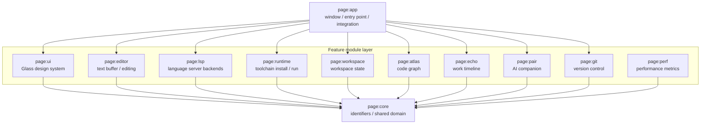

# PAGE IDE

> 한국어: [README.md](https://monkshark.github.io/page-ide/#README.md)

[](https://github.com/monkshark/page-ide/actions/workflows/ci.yml)


> Multi-language desktop IDE — **P**air · **A**tlas · **G**lass · **E**cho

**PAGE is a multi-language desktop IDE built from scratch with Kotlin and Compose Multiplatform Desktop.** It currently provides LSP-based completion and diagnostics for 24 languages, single-file execution for 13 languages, and in-IDE auto-installation of language servers and toolchains. Functionality is split across 12 modules with a strictly one-way dependency direction. The goal is to integrate four dimensions into one workspace: code (text), code graph (space), work timeline (time), and an AI companion (conversation).

[Devlog (Korean)](https://monkshark.github.io/categories/page-개발기/)

## Documentation hub

- [PAGE overview](https://monkshark.github.io/page-ide/#guides/overview_en.md) — Core values, what we will *not* build
- [Architecture guide](https://monkshark.github.io/page-ide/#guides/architecture_en.md) — Module design principles, dependency isolation, stack rationale
- [Docs index](https://monkshark.github.io/page-ide/) — docs site entry point

## What works today

The project is pre-alpha, but the following features are functional.

| Feature | Scope | Detail |
|---|---|---|
| **Multi-language LSP routing** | 24 languages | Detects the active file's extension and selects the matching language server (completion, diagnostics, go-to-definition, hover). |
| **Single-file Run** | 13 languages | Runs Python, Node, TypeScript, Kotlin, Java, Go, C/C++, Rust, C#, Bash, Dart, and Swift files without separate project setup. |
| **Runtime / toolchain auto-install** | ~10 kinds | Downloads and installs a missing language server or runner from within the IDE. Progress is shown in the status bar and continues in the background. |
| **Editor** | common | Multi-tab and split views, auto-indent, bracket matching, context menu, batch replace, autosave, workspace persistence. |

Supported languages: Kotlin, Java, Python, TypeScript/JavaScript, Go, Rust, C/C++, Swift, Dart/Flutter, Ruby, PHP, Vue, Svelte, JSON, YAML, HTML, CSS, SQL, Markdown, Dockerfile.

Auto-install targets: JDK, Node, Python, Go, Rust, .NET SDK, Dart/Flutter, Swift, LLVM/Clang, MinGW-w64, Windows SDK (MSVC, xwin).

## Core values

The four design pillars PAGE aims for. Pair, Atlas, and Echo are at the design / early-implementation stage — the descriptions below are target scenarios, not finished features.

| Pillar | Meaning |
|---|---|
| **Pair** | An AI companion that observes context and converses — observer / chat / agent / tutor |
| **Atlas** | A code graph that visualizes modules, functions, and dependencies as nodes and edges |
| **Glass** | A dark-first glassmorphism design system — soft motion, focus mode |
| **Echo** | A work timeline that persists keystrokes and change events locally |

See [overview_en.md](https://monkshark.github.io/page-ide/#guides/overview_en.md) for detailed scenarios of each pillar.

## Architecture

Functionality is split into modules, and dependencies always flow in one direction. The bottom `core` module is pure Kotlin with no external library dependencies and serves as the foundation for every module.



### Directory layout

```
page/
├── core/        Identifiers / shared domain models (pure Kotlin, no external deps)
├── perf/        Performance metrics
├── ui/          Glass design system (Material 3 + design tokens)
├── editor/      Text buffer control and editing logic
├── lsp/         Language server backends (LSP4J-based JSON-RPC, multi-instance routing)
├── runtime/     Per-language toolchain install and single-file compile/run
├── workspace/   Workspace state management and persistence
├── atlas/       Code graph (design stage)
├── echo/        Work timeline (design stage)
├── pair/        AI companion (design stage)
├── git/         Version control integration (design stage)
└── app/         Window / entry point / full module integration (Main)
```

- One-way dependency: `app → feature modules → core`
- `core` has no external library dependencies (pure Kotlin)

See [architecture_en.md](https://monkshark.github.io/page-ide/#guides/architecture_en.md) for the design rationale.

## Key engineering challenges

Representative challenges faced while building features, framed as problem and solution.

### 1. Multi-language LSP routing

- **Problem**: The initial design coupled `LspController` to a single language server (Kotlin), so completion and diagnostics did not work for files of other extensions.
- **Solution**: Introduced a central routing layer that branches to language server instances by file extension. `LanguageDefinition` metadata abstracts per-language differences, unifying the completion path for 24 languages with minimal code change.

### 2. Single-file Swift execution on Windows

- **Problem**: The previous tar parser handled only the ustar 100-byte name limit, so long paths (swiftmodule) recorded via GNU `@LongLink` / PAX extended headers were truncated during extraction. Swift code using `import Foundation` also failed to build and link on Windows.
- **Solution**: Replaced the extractor with one that handles GNU `@LongLink` / PAX extended headers, eliminating path truncation. Linked Windows SDK (MSVC, xwin) headers/libraries and the Foundation import library into the `swiftc` link step, and normalized case-insensitive duplicate `Path`/`PATH` keys in the child process environment to prevent potential environment-variable collisions in the language runtime.

### 3. Incremental build cache

- **Problem**: Compiled languages recompiled on every run even when the source was unchanged, adding wait time.
- **Solution**: Implemented a cache that compares modification times of the output and input sources along with build-command identity, skipping the rebuild when nothing changed. In the measured environment (local Windows), a single Swift file took about 10 seconds on first run (including module cache build) and about 2.5 seconds on re-run once the module cache was established; on a cache hit the compile step is skipped.

### 4. Decoupling domain logic from UI

- **Problem**: Editing state and UI composables accumulated in the top-level integration module (`app`), creating high coupling and heavy prop drilling.
- **Solution**: Moved editing and workspace state into dedicated state holders to isolate responsibilities and reduced unnecessary callback prop passing. Extracted the layout composable into its own file for readability and unit-test ease.

## Tech stack

| Category | Choice |
|---|---|
| **Language** | Kotlin 2.1.20 (JDK 21 toolchain via Foojay) |
| **UI** | Compose Multiplatform 1.7.3 — Desktop only |
| **Theme** | Material 3 + Glass design tokens (dark first) |
| **LSP** | LSP4J-based JSON-RPC, multi-instance language server routing |
| **Build** | Gradle 8.14 + version catalog (`gradle/libs.versions.toml`) |
| **Daemon JVM** | `gradle/gradle-daemon-jvm.properties` (toolchainVersion=21, vendor=ADOPTIUM) |
| **CI** | GitHub Actions — ubuntu-latest + Temurin 21 + `./gradlew build` |

## Build / run

The JDK is auto-provisioned by the Gradle toolchain, so the wrapper script alone builds the project without a separate install.

```bash
# Run the application
./gradlew :page:app:run

# Full build + tests
./gradlew build

# Test a single module
./gradlew :page:runtime:test
```

## Contribution / workflow

- **main branch is protected**: no direct push. All changes go feature branch → PR → CI green → squash merge.
- **CI gate**: ubuntu-latest + Temurin 21 + `./gradlew build`. Merge requires a green build.
- **Test policy**: unit tests required for features with real behavior code. Skeleton/scaffolding is exempt.

## License

> TBD — pre-alpha.

## Contact

- Bug / feature: [GitHub Issues](https://github.com/monkshark/page-ide/issues)
- Devlog (Korean): <https://monkshark.github.io/categories/page-개발기/>
- Email: justinchoo0814@gmail.com
