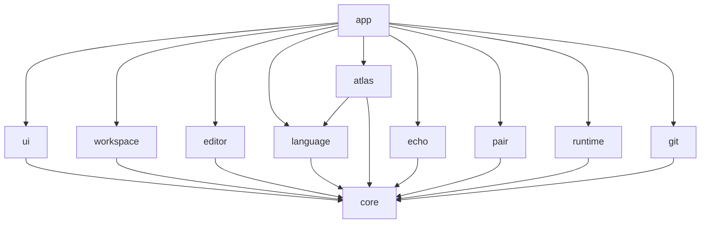

# 아키텍처

> English: [architecture_en.md](https://monkshark.github.io/page-ide/#guides/architecture_en.md)

> 모듈 경계, 의존 방향, 기술 스택 결정.

이 문서는 코드가 채워지면서 살이 붙는다. 현재는 결정된 골격만 정리한다.

---

## 기술 스택

| 영역 | 선택 | 비고 |
|---|---|---|
| 언어 | Kotlin (JVM 21+) | 자바 생태계 라이브러리 그대로 활용 |
| UI | Compose Multiplatform Desktop | JetBrains Fleet 동일 스택, Skia 기반 |
| 빌드 | Gradle (Kotlin DSL) | 멀티모듈 |
| LSP | LSP4J (Eclipse) | 다언어 지원 표준 |
| 신택스 | Tree-sitter | JNI 바인딩 |
| Git | JGit | 자체 구현 회피 |
| 로컬 저장 | SQLite (xerial JDBC) | Echo 타임라인 |
| AI HTTP | OkHttp | `LLMProvider` 인터페이스 + 어댑터 4종 |
| PTY | JediTerm 또는 pty4j | 프로토타입 후 결정 |

---

## 모듈 구조 (계획)

```
page/
├── core         (공통 유틸, 도메인 타입, 이벤트 버스)
├── editor       (텍스트 버퍼, 신택스 하이라이팅, 키 입력)
├── language     (LSP 클라이언트, 언어 정의 JSON 로더)
├── workspace    (파일 트리, 다중 탭, 분할 화면, 프로젝트 모델)
├── ui           (Compose 컴포넌트, Glass 디자인 토큰)
├── atlas        (코드 그래프 분석 + 렌더)
├── echo         (키스트로크 레코더 + 타임라인 UI)
├── pair         (LLMProvider, 어댑터, 채팅/관찰자/에이전트/튜터)
├── runtime      (PTY, 빌드/실행, 출력 패널)
├── git          (JGit 래퍼, diff/스테이지/커밋 UI)
└── app          (조립층, 메인 진입점)
```

> 각 모듈의 상세 책임은 코드가 들어오면서 별도 문서로 분리한다.

---

## 의존 방향 (계획)



원칙은 단순하다.

- 모든 모듈은 `core`만 의존한다 (또는 `core`도 의존하지 않는다).
- 기능 모듈끼리(예: `editor` ↔ `pair`)는 직접 의존하지 않는다. 통신은 `core`의 이벤트 버스나 인터페이스로.
- 조립과 와이어링은 `app`이 전담한다.

---

## AI 프로바이더 전략

`LLMProvider` 인터페이스를 두고 어댑터 네 가지로 갈아끼운다.

```kotlin
interface LLMProvider {
    suspend fun complete(prompt: Prompt): Flow<TokenChunk>
    fun supportsTools(): Boolean
}
```

- Ollama — 로컬, 기본. 코드가 PC를 떠나지 않는다.
- Anthropic Claude — 사용자 본인 API 키.
- OpenAI ChatGPT — 사용자 본인 API 키.
- OpenAI 호환 endpoint — Together AI / Groq / 자체 호스팅 등 endpoint URL 직접 입력.

API 키는 OS 키체인에 저장한다 (Windows Credential Manager 등). 평문 저장 금지.

---

- [개요로 돌아가기](https://monkshark.github.io/page-ide/#guides/overview.md)
- [목차로 돌아가기](https://monkshark.github.io/page-ide/#README_kr.md)
