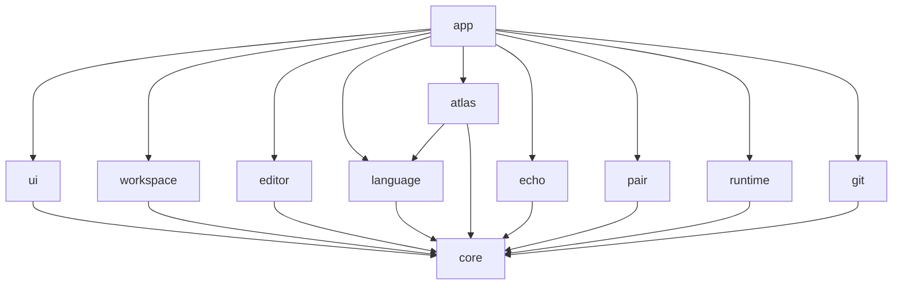

# Architecture

> 한국어: [architecture.md](https://monkshark.github.io/PAGE_IDE/#guides/architecture.md)

> Module boundaries, dependency direction, and stack choices.

This document grows as code lands. For now, only the decided skeleton is captured.

---

## Stack

| Area | Choice | Note |
|---|---|---|
| Language | Kotlin (JVM 21+) | Reuse JVM libraries directly |
| UI | Compose Multiplatform Desktop | Same stack as JetBrains Fleet, Skia-based |
| Build | Gradle (Kotlin DSL) | Multi-module |
| LSP | LSP4J (Eclipse) | Multi-language standard |
| Syntax | Tree-sitter | JNI bindings |
| Git | JGit | Avoid reimplementing |
| Local store | SQLite (xerial JDBC) | Echo timeline |
| AI HTTP | OkHttp | `LLMProvider` interface + 4 adapters |
| PTY | JediTerm or pty4j | Decide after prototyping |

---

## Module structure (planned)

```
page/
├── core         (shared utilities, domain types, event bus)
├── editor       (text buffer, syntax highlighting, key input)
├── language     (LSP client, language-definition JSON loader)
├── workspace    (file tree, multi-tab, split panes, project model)
├── ui           (Compose components, Glass design tokens)
├── atlas        (code graph analysis + render)
├── echo         (keystroke recorder + timeline UI)
├── pair         (LLMProvider, adapters, chat/observer/agent/tutor)
├── runtime      (PTY, build/run, output panel)
├── git          (JGit wrapper, diff/stage/commit UI)
└── app          (assembly layer, main entry point)
```

> Each module's detailed responsibilities will move to its own document as code lands.

---

## Dependency direction (planned)



The rules are simple.

- Every module depends only on `core` (or on nothing).
- Feature modules (e.g. `editor` ↔ `pair`) do not depend on each other directly. Communication goes through `core` event buses or interfaces.
- Assembly and wiring live in `app`.

---

## AI provider strategy

A single `LLMProvider` interface with four swappable adapters.

```kotlin
interface LLMProvider {
    suspend fun complete(prompt: Prompt): Flow<TokenChunk>
    fun supportsTools(): Boolean
}
```

- **Ollama** — local, default. Code never leaves the user's machine.
- **Anthropic Claude** — user-supplied API key.
- **OpenAI ChatGPT** — user-supplied API key.
- **OpenAI-compatible endpoint** — Together AI / Groq / self-hosted; user supplies the endpoint URL.

API keys are stored in the OS keychain (Windows Credential Manager, macOS Keychain, libsecret on Linux). No plaintext storage.

---

- [Back to overview](https://monkshark.github.io/PAGE_IDE/#guides/overview_en.md)
- [Back to index](https://monkshark.github.io/PAGE_IDE/#README_en.md)
