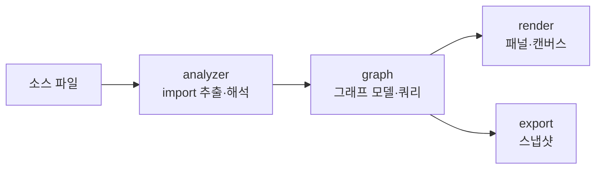

# Atlas

> `page:atlas` — 코드 그래프. import · 호출 · 모듈 의존을 노드와 엣지로 시각화

파일 트리는 디렉터리 구조만 보여준다. 무엇이 무엇을 부르고, 어떤 모듈이 어디에 의존하는지는 트리에 드러나지 않는다. Atlas는 소스에서 관계를 뽑아 그래프로 그려, 낯선 코드베이스에 들어온 개발자가 "이 파일이 프로젝트 어디에 붙어 있나"를 눈으로 확인하게 한다.

> English: [main_en.md](https://monkshark.github.io/page-ide/#internals/atlas/main_en.md)

---

## 구성

모듈은 네 층으로 나뉜다.



| 층 | 역할 |
|---|---|
| `analyzer` | tree-sitter로 소스에서 import를 추출하고, 실제 파일 경로로 해석 |
| `graph` | 추출한 관계를 노드·엣지 모델로 쌓고 질의 (사이클, 의존 수 등) |
| `render` | Compose 캔버스·패널로 그래프를 그리고 상호작용 |
| `export` | 그래프 스냅샷을 JSON으로 내보냄 (문서 뷰어 위젯이 소비) |

---

## analyzer — import 추출과 해석

`ImportExtractor`는 tree-sitter 파서로 소스에서 import 구문을 뽑는다. 확장자로 언어를 판정하며, 다음을 지원한다.

Java · Kotlin · Python · JavaScript · TypeScript · Go · Rust · Dart · C · C++ · Scala · Ruby · PHP · C# · Swift · Vue · Svelte

추출한 import는 문자열일 뿐이라, 실제 파일로 이어 줘야 엣지가 된다. `ImportResolver`가 공통 해석을 맡고, 패키지 매니페스트가 있는 언어는 전용 resolver가 처리한다.

| resolver | 근거 |
|---|---|
| `GoModResolver` | `go.mod`의 module 경로 |
| `PubspecResolver` | Dart `pubspec.yaml`의 package name |
| `TsConfigResolver` | `tsconfig.json`의 path 매핑 |

`DeclarationIndex`는 심볼 선언 위치를, `StaticCallHierarchySource`는 정적 호출 관계를 모아 호출 그래프의 바탕이 된다.

---

## graph — 모델과 질의

`CodeGraphProvider`는 그래프 데이터의 인터페이스다. `ImportGraphProvider`가 이를 구현해 파일별·프로젝트별 슬라이스를 만든다.

```kotlin
interface CodeGraphProvider {
    fun nodesForFile(path: Path, text: String): GraphSlice
    fun nodesForProject(activePath: Path?, activeText: String?): GraphSlice
}
```

프로젝트 전체 그래프에서는 순환 의존(`projectCycles`), 파일별 피의존 수(`dependentCountOf`), 의존 다이제스트(`dependencyDigest`)를 뽑는다. `ModuleGraph` · `ModuleLayers` · `ModulePath`는 파일 그래프를 모듈 단위로 접어 계층을 만들고, `SymbolGraph`는 심볼 단위 관계를 다룬다.

---

## render — 모듈, 관계 탐색, 구조 문제

엔트리 컴포저블은 `AtlasContent`다. 상단에서 세 탭을 오간다.

| 탭 (`AtlasViewTab`) | 내용 |
|---|---|
| `MODULES` — Modules | `OverviewCanvas` — 모듈 카드, 폴더 진입, breadcrumb, 파일 이동 |
| `FILE` — Explore | `DependencyExplorationPanel` — 파일 관계 확장, 코드 근거, 경로·영향 탐색 |
| `PROBLEMS` — Problems | `AtlasProblemsPanel` — 프로젝트 순환·허브. 파일 선택으로 Explore에 진입 |

호출 그래프는 별도 사이드패널(`CallGraphPanel` · `CallsView`)을 유지한다. 검색은 파일명과 경로를 찾으며, 이슈에서 복사한 경로로도 시작할 수 있다. Enter로 검색 결과를 탐색한다. 모듈 검사 영역의 Explore 버튼으로 파일을 편집기에 열지 않고 관계부터 확인할 수도 있다.

`DependencyExploration`은 방향별 확장, 고정된 격자 좌표, 방향을 따르는 경로 추적, 순환 그룹, 역의존 영향 탐색을 맡는다. 처음에는 양방향 이웃을 최대 세 개씩 보여주고, 이후 네 개씩 추가한다. 화면 제한은 80개이며 숨겨진 이웃 수를 표시한다. 노드를 선택해도 기존 좌표는 바뀌지 않는다. 드래그·휠 줌·Fit으로 카메라를 조작한다. `AtlasViewState`의 `ExplorationViewState`가 선택·펼침·카메라를 보관하므로 같은 IDE 실행 세션에서 Atlas를 닫았다 열어도 유지된다. Back은 이전 탐색 상태를 복원한다.

A → B는 A가 B를 사용한다는 뜻이다. 선이나 이웃 목록의 View source를 선택하면 관계 종류와 분석한 코드 근거를 확인한다. Tree-sitter가 읽은 정확한 구문과 0부터 시작하는 줄 번호를 `FileAnalysis`에 기록하고, `ImportGraphProvider`가 import 해소와 상속 관계 승격 과정에서 `GraphEdge.evidence`로 전달한다. 정적 분석이므로 실행 흐름이나 모든 런타임 의존성을 보장하지 않는다. 영향 표시는 확인할 피의존 후보이며 반드시 실패한다는 뜻이 아니다. 코드 근거는 분석 당시의 스냅샷이다.

Explore의 파일 카드는 글자를 세로 중앙에 배치하고, 선택 테두리와 Selected file 문구로 현재 파일을 표시한다. Uses·Used by 개수는 나가는 연결·들어오는 연결과 같은 색을 사용한다. 선택한 카드 아래에서 방향별로 가지를 펼치고 접을 수 있다. 가지별 연결 기록을 추적해 다른 열린 가지로도 이어지는 파일, 시작 파일, 경로·영향 탐색으로 명시적으로 표시한 파일은 남긴다. 접은 뒤에도 남은 카드의 좌표는 바뀌지 않는다.

`ExplorationViewport`는 새로 표시하거나 선택한 파일이 보이도록 필요한 만큼 화면을 이동하고, 함께 표시할 파일들이 들어가지 않을 때만 축소한다. 화면 이동 요청은 한 번만 처리하므로 이후 직접 움직인 카메라는 Atlas를 다시 열어도 유지된다. 80% 미만으로 축소하면 아이콘과 경로를 숨기고 화면 기준으로 파일명 글자 크기를 유지하며, 공간이 부족하면 말줄임한다. 파일에 마우스를 올리면 전체 이름과 경로를 보여주고, 연결선에 올리면 선택을 바꾸지 않은 채 선을 강조하고 출발 파일·관계 종류·도착 파일을 미리 보여준다.

상세 패널은 파일 상세와 연결 상세 중 하나를 보여준다. 연결 상세에는 출발·도착 파일, 코드 미리보기, 소스 열기 버튼을 묶는다. Visited는 종속성 순서가 아닌 파일 방문 순서를 표시하며, 이전 항목을 선택하면 해당 파일로 돌아간다. Back은 이전 방문 기록과 카메라를 복원한다. Clear highlight나 그래프에 포커스가 있을 때의 Escape는 펼친 그래프를 유지하면서 연결 선택과 강조만 해제한다. 폭이 880 dp보다 좁으면 상세 패널을 그래프 아래로 옮기고 별도 스크롤바를 제공한다. Fit view와 확대·축소 버튼은 표시된 파일 수 옆에 둔다. 다크·라이트 색상은 기존 Glass 테마를 따른다.

---

경로 목적지는 아직 화면에 표시되지 않은 파일까지 분석 범위의 파일명·경로로 검색한다. 해당 방향의 경로가 없으면 명시적으로 알린다. 잠재적 영향은 직접 피의존과 단계 수를 표시하며 간접 연결은 점선으로 구분한다. 순환 카드는 구성원 목록을 표시하고 실제로 확인하지 않은 연결 순서를 화살표로 만들어 내지 않는다.

## IDE 통합

Atlas는 확장 패널(`ExpandedPanel.ATLAS`)로 열린다.

- 에디터 컨텍스트 메뉴 Show in Atlas — 선택한 파일의 관계 탐색 시작
- 단축키 `FOCUS_IN_ATLAS` → `focusInAtlas(path)` — 활성 파일을 Explore에서 탐색
- Open file 또는 Open source at line — Atlas를 닫고 편집기에서 파일·소스 줄을 열며 파일 관계 사이드패널 유지
- 탭 전환·패널 크기는 MVI 이벤트(`AtlasViewTabChanged` · `ResizeAtlas` · `FocusInAtlas`)로 흐른다

---

## export — 스냅샷

`SnapshotExporter`는 그래프를 JSON 스냅샷으로 내보낸다. 문서 뷰어의 Atlas 위젯이 이 스냅샷을 읽어 라이브 IDE 없이도 그래프를 보여 준다. 소스 구문은 내보내지 않는다. 기존 스냅샷이나 호출 그래프에는 관계 근거가 없을 수 있다.

---

- [목차로 돌아가기](https://monkshark.github.io/page-ide/#README_kr.md)
