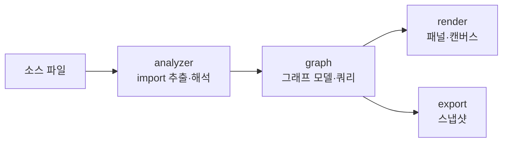

# Atlas

> `page:atlas` — 코드 그래프. import · 호출 · 모듈 의존을 노드와 엣지로 시각화

파일 트리는 디렉터리 구조만 보여준다. 무엇이 무엇을 부르고, 어떤 모듈이 어디에 의존하는지는 트리에 드러나지 않는다. Atlas는 소스에서 관계를 뽑아 그래프로 그려, 낯선 코드베이스에 들어온 개발자가 "이 파일이 프로젝트 어디에 붙어 있나"를 눈으로 확인하게 한다.

> English: [main_en.md](https://monkshark.github.io/page-ide/#internals/atlas/main_en.md)

---

## 구성

모듈은 네 층으로 나뉜다.



| 층 | 역할 |
|---|---|
| `analyzer` | tree-sitter로 소스에서 import를 추출하고, 실제 파일 경로로 해석 |
| `graph` | 추출한 관계를 노드·엣지 모델로 쌓고 질의 (사이클, 의존 수 등) |
| `render` | Compose 캔버스·패널로 그래프를 그리고 상호작용 |
| `export` | 그래프 스냅샷을 JSON으로 내보냄 (문서 뷰어 위젯이 소비) |

---

## analyzer — import 추출과 해석

`ImportExtractor`는 tree-sitter 파서로 소스에서 import 구문을 뽑는다. 확장자로 언어를 판정하며, 다음을 지원한다.

Java · Kotlin · Python · JavaScript · TypeScript · Go · Rust · Dart · C · C++ · Scala · Ruby · PHP · C# · Swift · Vue · Svelte

추출한 import는 문자열일 뿐이라, 실제 파일로 이어 줘야 엣지가 된다. `ImportResolver`가 공통 해석을 맡고, 패키지 매니페스트가 있는 언어는 전용 resolver가 처리한다.

| resolver | 근거 |
|---|---|
| `GoModResolver` | `go.mod`의 module 경로 |
| `PubspecResolver` | Dart `pubspec.yaml`의 package name |
| `TsConfigResolver` | `tsconfig.json`의 path 매핑 |

`DeclarationIndex`는 심볼 선언 위치를, `StaticCallHierarchySource`는 정적 호출 관계를 모아 호출 그래프의 바탕이 된다.

선언 인덱싱은 `ImportExtractor.analyzeDeclarations`로 패키지명·최상위 심볼·줄 번호만 수집하며 import·상속·호출 구문을 순회하지 않는다. 선언 수집을 지원하지 않는 파일은 제외한다. `ImportGraphProvider`는 선언 결과를 전체 파일 분석과 별도로 캐시하고 수정 시간이 같은 결과를 재사용한다. 한 번의 그래프 계산에서는 작업 공간 스냅샷을 유지해 TTL 만료에 따른 재검색을 막는다.

`analyzeProject`는 `ProjectAnalysisProgress`로 파일 검색·선언 인덱싱·종속성 연결 단계를 알린다. UI는 초기 선언 분석부터 단계와 완료 파일 수를 표시하고, 이후 활성 파일 분석 상태를 보여준다. 처음 열 때는 편집용 지연 없이 시작하며 이후 갱신에는 지연을 유지한다. 취소는 빈 그래프로 바꾸지 않고 호출부로 전파한다. 기존 `nodesForProject`의 파일별 진행률 콜백도 유지한다.

---

## graph — 모델과 질의

`CodeGraphProvider`는 그래프 데이터의 인터페이스다. `ImportGraphProvider`가 이를 구현해 파일별·프로젝트별 슬라이스를 만든다.

```kotlin
interface CodeGraphProvider {
    fun nodesForFile(path: Path, text: String): GraphSlice
    fun nodesForProject(activePath: Path?, activeText: String?): GraphSlice
}
```

프로젝트 전체 그래프에서는 순환 의존(`projectCycles`), 파일별 피의존 수(`dependentCountOf`), 의존 다이제스트(`dependencyDigest`)를 뽑는다. `ModuleGraph` · `ModuleLayers` · `ModulePath`는 파일 그래프를 모듈 단위로 접어 계층을 만들고, `SymbolGraph`는 심볼 단위 관계를 다룬다.

---

## render — 모듈, 관계 탐색, 구조 문제

엔트리 컴포저블은 `AtlasContent`다. 상단에서 세 탭을 오간다.

| 탭 (`AtlasViewTab`) | 내용 |
|---|---|
| `MODULES` — Project map | `OverviewCanvas` — 모듈 카드, 폴더 진입, breadcrumb |
| `FILE` — Explore | `DependencyExplorationPanel` — 파일 관계 확장, 코드 근거, 경로·영향 탐색 |
| `PROBLEMS` — Problems | `AtlasProblemsPanel` — 프로젝트 순환·허브. 파일 선택으로 Explore에 진입 |

호출 그래프는 별도 사이드패널(`CallGraphPanel` · `CallsView`)을 유지한다. 검색은 파일명과 경로를 찾으며, 이슈에서 복사한 경로로도 시작할 수 있다. Enter로 검색 결과를 탐색한다. Project map은 Structure 사이드바 없이 모듈 그래프가 전체 폭을 사용한다. 더블클릭으로 모듈 안에 진입하거나 파일을 편집기 대신 Explore에서 연다. Project map 버튼으로 이전 모듈 화면에 돌아간다. 모듈 카드는 높이를 줄이고 글자를 세로 중앙에 배치하며, 차분한 테두리와 단색 배경으로 선택한 연결을 강조한다.

Explore는 전체 폭의 그래프를 기본 화면으로 사용한다. 상단에는 현재 파일과 편집기 열기, Change impact를 두고 보조 메뉴에 Trace path·Find cycles·Focus here·Code context를 묶는다. 오른쪽 파일 목록과 상세 패널 토글은 제거했다. 파일·모듈 화면 모두 현재 다크·라이트 테마를 따른다.

탭은 밑줄로 선택 상태를 표시한다. Explore는 196 × 58 크기의 파일 카드와 284 × 112 격자를 사용한다. 파일명과 경로는 세로 중앙에 배치하고 최초 화면 맞춤은 115%를 넘지 않는다. 기본 연결은 중립색이며 선택한 관계와 분석 결과만 강조한다. 이웃이 해당 방향의 한 열에 모여 있을 때 Uses·Used by 제목으로 방향을 안내한다.

Trace path는 탐색 도구 바로 아래에 목적지 검색을 연다. 경로·순환·영향 결과에서 Read connections를 누르거나 연결을 선택하면 하단 코드 미리보기가 열린다. Previous connection·Next connection으로 근거를 순서대로 읽으며 그래프 강조와 카메라를 유지한다. 코드 위치가 없으면 명시적으로 알린다. Project map의 모듈 분류·배치·폴더 탐색 동작은 유지한다.

Problems는 테마를 따르는 구조 검토 화면으로, All·Cycles·Shared files 필터를 제공한다. 선택 가능한 목록 옆에 설명과 관련 파일을 보여주며, 폭이 820 dp보다 좁으면 위아래로 배치한다. 항목은 구조를 검토할 단서이며 컴파일 오류나 확정된 심각도 등급이 아니다. Explore cycle은 순환 연결을 강조한 그래프를 열고, Review change impact는 역의존 관계를 강조한다. 관련 파일마다 Explore·Open 동작을 명시하고, Open은 Atlas를 닫고 편집기로 돌아간다. 비어 있는 분류에서는 전체 목록으로 돌아갈 수 있다.

각 항목은 최대 여섯 파일과 분석으로 확인한 연결만 미리보기 그래프에 표시하고 표시 범위를 알린다. 그래프에서 파일을 선택하면 연결 목록을 좁히며, 같은 파일을 다시 선택하거나 All connections를 누르면 필터를 해제한다. 연결을 펼치면 추출한 코드 근거를 읽고 편집기에서 정확한 줄을 열 수 있다. 더 큰 구조는 전체 Explore로 이어서 확인한다. 좁은 화면에서는 항목 목록을 가로 선택 형태로 줄여 그래프와 근거를 읽을 공간을 확보한다.

`DependencyExploration`은 방향별 확장, 고정된 격자 좌표, 방향을 따르는 경로 추적, 순환 그룹, 역의존 영향 탐색을 맡는다. 처음에는 양방향 이웃을 최대 세 개씩 보여주고, 이후 네 개씩 추가한다. 화면 제한은 80개이며 숨겨진 이웃 수를 표시한다. 노드를 선택해도 기존 좌표는 바뀌지 않는다. 드래그·휠 줌·Fit으로 카메라를 조작한다. `AtlasViewState`의 `ExplorationViewState`가 선택·펼침·카메라를 보관하므로 같은 IDE 실행 세션에서 Atlas를 닫았다 열어도 유지된다. Back은 이전 탐색 상태를 복원한다.

A → B는 A가 B를 사용한다는 뜻이다. 연결선을 선택하면 관계 종류와 분석한 코드 근거를 확인한다. Tree-sitter가 읽은 정확한 구문과 0부터 시작하는 줄 번호를 `FileAnalysis`에 기록하고, `ImportGraphProvider`가 `GraphEdge.evidence`로 전달한다. 정적 분석이므로 모든 런타임 의존성을 보장하지 않는다. 영향 표시는 확인할 피의존 후보이며 반드시 실패한다는 뜻이 아니다. 코드 근거는 분석 당시의 스냅샷이다.

Explore의 파일 카드는 선택 테두리와 Selected file 문구로 현재 파일을 표시한다. 카드 아래에서 방향별로 가지를 펼치고 접는다. 명시적인 가지 확장은 기존 노드 좌표·카메라 위치·확대율을 유지한다. 화면 밖에 추가된 파일은 드래그하거나 Fit으로 확인한다. 접을 때는 다른 열린 가지로 이어지는 파일, 시작 파일, 경로·영향 탐색으로 명시한 파일을 남긴다.

`ExplorationViewport`는 선택한 파일과 분석 결과가 보이도록 필요한 만큼 화면을 이동하고, 함께 표시할 파일들이 들어가지 않을 때만 축소한다. 명시적인 가지 확장에는 이 카메라 조정을 적용하지 않는다. 화면 이동 요청은 한 번만 처리하므로 이후 직접 움직인 카메라는 Atlas를 다시 열어도 유지된다. 80% 미만으로 축소하면 아이콘과 경로를 숨기고 화면 기준으로 파일명 글자 크기를 유지하며, 공간이 부족하면 말줄임한다. 파일에 마우스를 올리면 전체 이름과 경로를 보여주고, 연결선에 올리면 선택을 바꾸지 않은 채 선을 강조하고 출발 파일·관계 종류·도착 파일을 미리 보여준다.

연결 미리보기는 창 너비와 관계없이 그래프 아래에 열린다. 높이는 최대 210 dp이며 그래프 영역의 42% 이내로 제한한다. 출발·도착 파일, 관계 종류, 줄 번호, 코드와 Open 동작을 제공하고, 정확한 줄을 편집기에서 열 수 있다. 닫거나 Escape를 누르면 미리보기만 닫고 분석 강조는 유지한다. 탐색 기록은 파일 방문 순서이며 Back은 이전 탐색 상태와 카메라를 복원한다. Fit과 확대·축소는 하단 도구에 둔다.

---

경로 목적지는 아직 화면에 표시되지 않은 파일까지 분석 범위의 파일명·경로로 검색한다. 해당 방향의 경로가 없으면 명시적으로 알린다. 잠재적 영향은 직접 피의존과 단계 수를 표시하며 간접 연결은 점선으로 구분한다. 순환 카드는 구성원 목록을 표시하고 실제로 확인하지 않은 연결 순서를 화살표로 만들어 내지 않는다.

## IDE 통합

Atlas는 확장 패널(`ExpandedPanel.ATLAS`)로 열린다.

창 바깥 여백은 24 dp이며 폭이 700 dp 미만이면 12 dp로 줄인다. 배경 어둡기는 24%로 낮추고 얇은 테두리와 둥근 모서리로 창을 구분한다. Esc는 내부 조작이 먼저 처리한다. Code context에서는 그래프로 돌아가고, 그래프의 연결 선택·강조가 있으면 해제하며, 내부에서 처리하지 않은 Esc는 Atlas를 닫는다. 파일 검색에는 검색어가 있을 때만 지우기 동작을 표시한다.

- 에디터 컨텍스트 메뉴 Show in Atlas — 선택한 파일의 관계 탐색 시작
- 단축키 `FOCUS_IN_ATLAS` → `focusInAtlas(path)` — 활성 파일을 Explore에서 탐색
- Open file 또는 Open source at line — Atlas를 닫고 편집기에서 파일·소스 줄을 열며 파일 관계 사이드패널 유지
- 탭 전환·패널 크기는 MVI 이벤트(`AtlasViewTabChanged` · `ResizeAtlas` · `FocusInAtlas`)로 흐른다

---

## export — 스냅샷과 코드 묶기

`SnapshotExporter`는 그래프를 JSON 스냅샷으로 내보낸다. 문서 뷰어의 Atlas 위젯이 이 스냅샷을 읽어 라이브 IDE 없이도 그래프를 보여 준다. 소스 구문은 내보내지 않는다. 기존 스냅샷이나 호출 그래프에는 관계 근거가 없을 수 있다.

Code context는 사용자가 직접 실행하는 별도의 로컬 내보내기다. `CodeBundles`는 선택한 파일, 직접 의존 파일, 직접 피의존 파일 또는 현재 그래프에 표시된 파일을 묶는다. 체크 목록에서 분석된 소스 파일을 개별적으로 포함하거나 제외할 수 있다. `CodeBundlePanel`은 UI 스레드 밖에서 저장된 UTF-8 파일을 읽고 상대 경로·코드·관계를 미리 보여준 뒤 클립보드에 복사한다. 저장하지 않은 편집 내용은 포함하지 않는다. 외부 노드는 제외하며, 읽을 수 없거나 바이너리인 파일은 이유를 표시한다. 코드 내용은 파일당 32,000자, 묶음당 256,000자로 제한하고 생략·발췌 사실을 알린다. 미리보기는 처음 12,000자를 표시하며, 복사에는 준비된 묶음 전체를 포함한다. 외부 서비스로 전송하지 않는다.

Code context는 같은 Atlas 창의 그래프 영역을 대체한다. 배경을 다시 어둡게 덮거나 별도 창을 띄우지 않고 Back to graph로 탐색에 복귀한다. 파일 검색과 Selected 필터는 체크 목록만 좁히며 선택 상태나 복사할 묶음을 바꾸지 않는다. 좁은 화면에서는 파일 선택과 미리보기를 전환해 각 내용을 전체 높이로 읽는다.

---

- [목차로 돌아가기](https://monkshark.github.io/page-ide/#README_kr.md)
