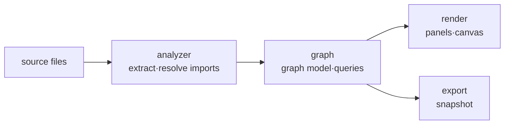

# Atlas

> `page:atlas` — code graph. Visualizes import · call · module dependencies as nodes and edges

A file tree shows only directory structure. What calls what, and which module depends on where, never surfaces in the tree. Atlas extracts those relations from source and draws them as a graph, so a developer new to a codebase can see where a file sits in the project at a glance.

> 한국어: [main.md](https://monkshark.github.io/page-ide/#internals/atlas/main.md)

---

## Structure

The module splits into four layers.



| Layer | Role |
|---|---|
| `analyzer` | Extracts imports from source with tree-sitter, resolves them to real file paths |
| `graph` | Builds relations into a node/edge model and queries it (cycles, dependent counts, etc.) |
| `render` | Draws and interacts with the graph via Compose canvas and panels |
| `export` | Exports a graph snapshot to JSON (consumed by the docs viewer widget) |

---

## analyzer — extracting and resolving imports

`ImportExtractor` pulls import statements from source using tree-sitter parsers. It detects the language by file extension and supports:

Java · Kotlin · Python · JavaScript · TypeScript · Go · Rust · Dart · C · C++ · Scala · Ruby · PHP · C# · Swift · Vue · Svelte

An extracted import is just a string; it has to be linked to a real file before it becomes an edge. `ImportResolver` handles the common cases, and languages with a package manifest get a dedicated resolver.

| Resolver | Basis |
|---|---|
| `GoModResolver` | `go.mod` module path |
| `PubspecResolver` | Dart `pubspec.yaml` package name |
| `TsConfigResolver` | `tsconfig.json` path mappings |

`DeclarationIndex` collects symbol declaration sites, and `StaticCallHierarchySource` gathers static call relations that back the call graph.

Declaration indexing uses `ImportExtractor.analyzeDeclarations`, which collects package names, top-level symbols and source locations without walking import, inheritance or call expressions. Files without supported declarations are excluded. `ImportGraphProvider` keeps declaration results separately from full file analysis and reuses unchanged results by modification time. A workspace snapshot prevents TTL-triggered rescans during one graph computation.

`analyzeProject` reports discovery, declaration indexing and dependency connection through `ProjectAnalysisProgress`. The UI shows the current phase and completed-file count, including the initial declaration pass, then indicates active-file analysis. First opening starts without the edit debounce; subsequent refreshes retain the debounce. Cancellation propagates instead of being converted into an empty graph. The existing `nodesForProject` callback remains available for per-file progress consumers.

---

## graph — model and queries

`CodeGraphProvider` is the interface for graph data. `ImportGraphProvider` implements it, producing per-file and per-project slices.

```kotlin
interface CodeGraphProvider {
    fun nodesForFile(path: Path, text: String): GraphSlice
    fun nodesForProject(activePath: Path?, activeText: String?): GraphSlice
}
```

From the whole-project graph it derives dependency cycles (`projectCycles`), per-file dependent counts (`dependentCountOf`), and a dependency digest (`dependencyDigest`). `ModuleGraph` · `ModuleLayers` · `ModulePath` fold the file graph into modules to form layers, and `SymbolGraph` handles symbol-level relations.

---

## render — modules, exploration and problems

The entry composable is `AtlasContent`. Its header switches between three tabs.

| Tab (`AtlasViewTab`) | Content |
|---|---|
| `MODULES` — Project map | `OverviewCanvas` — module cards, folder drill-in and breadcrumbs |
| `FILE` — Explore | `DependencyExplorationPanel` — expand file relationships, inspect source evidence, trace paths and potential impact |
| `PROBLEMS` — Problems | `AtlasProblemsPanel` — project cycles and highly depended-on files; select a file to explore it |

The call graph remains a separate side panel (`CallGraphPanel` · `CallsView`). Search matches file names and paths, including paths copied from an issue; Enter starts an exploration of the match. Project map gives the module graph the full width, without a Structure sidebar. Double-clicking drills into modules or starts Explore for a file without opening the editor. The Project map action returns to the retained module view. Compact, vertically centered module cards use subdued borders and a flat surface so selected connections remain prominent.

Explore uses a full-width graph by default. Its toolbar shows the selected file, an editor action and Change impact. The secondary menu contains Trace path, Find cycles, Focus here and Code context. The duplicate file list and inspector toggle are removed. File and module views follow the current light or dark theme.

Tabs use an underline. Explore uses 196 × 58 file cards on a 284 × 112 grid. File names and paths are vertically centered and initial fitting stops at 115%. Base connections are neutral; selection and analysis results receive emphasis. Uses and Used by headings appear when visible neighbors occupy a single column in the corresponding direction.

Trace path opens destination search just below the navigation tools. Read connections in path, cycle or impact results, or selecting an edge, opens a source preview below the graph. Previous connection and Next connection preserve analysis highlighting and the camera while reading evidence. Missing source locations are stated explicitly. Project map retains its module grouping, layout and drill navigation.

Problems uses a theme-aware structure review with All, Cycles and Shared files filters. A selectable finding list sits beside the explanation and related files, or above them below 820 dp. Findings are structural review signals, not compiler errors or assigned severity levels. Explore cycle opens the graph with cycle edges highlighted; Review change impact highlights reverse dependencies. Each related file has explicit Explore and Open actions; Open closes Atlas and returns to the editor. Empty categories offer a route back to all findings.

Each finding includes a connection map of up to six files and only their analyzed edges, with the preview limit stated explicitly. Selecting a map file filters the connection list; selecting it again or choosing All connections clears the filter. Expand a connection to read the extracted source and open the exact line in the editor. The full exploration remains available for larger findings. Compact layouts use a horizontal finding selector to leave more space for the map and evidence.

`DependencyExploration` owns directional expansion, stable grid positions, directed path tracing, cycle groups and reverse-dependency impact. The initial view shows up to three neighbors in each direction; further expansion adds up to four at a time, with an 80-node view cap and hidden counts. Selection never rearranges existing nodes. Pan, wheel zoom and Fit control the camera. `ExplorationViewState`, held by `AtlasViewState`, retains the selection, revealed nodes and camera while Atlas closes and reopens; Back restores earlier exploration states within the running IDE session.

A → B means A uses B. Selecting an edge reveals its relationship kind and analyzed source evidence. Tree-sitter records exact syntax and zero-based line numbers in `FileAnalysis`, and `ImportGraphProvider` forwards them through `GraphEdge.evidence`. Static analysis does not guarantee all runtime dependencies. Impact results are candidates to review, not guaranteed failures. Evidence is a snapshot from analysis time.

Explore cards identify the selected file with a border and Selected file label. Controls below it expand or collapse each direction. Explicit branch expansion preserves existing node coordinates, camera position and zoom. Pan or Fit reveals additions outside the viewport. Collapse retains files belonging to other open branches, the starting file and files explicitly revealed by path or impact analysis.

`ExplorationViewport` brings selected files and analysis results into view with the smallest required pan, reducing zoom when the group cannot fit. Explicit branch expansion opts out of this camera adjustment. A visibility request is consumed once so reopening Atlas preserves subsequent manual camera movement. Below 80% zoom, cards hide icons and paths and render file names at a fixed screen text size, with ellipsis when necessary. Hovering reveals the full file label and path; hovering a connection highlights it and previews its source, relation kind and target without selecting it.

Connection preview opens below the graph at every window width. Its height is capped at 210 dp and 42% of the graph region. It shows source and destination, relation kind, line number, code and an Open action that navigates to the exact editor line. Closing it or pressing Escape dismisses only the preview and preserves analysis highlighting. The trail follows visit order; Back restores the previous exploration and camera. Fit and zoom remain in the bottom toolbar.

---

The path picker searches destination file names and paths across the analyzed graph, including files not yet visible. A direction with no path produces an explicit empty result. Potential impact labels direct dependents and hop counts, with dashed indirect connections. Cycle cards list group members without inventing an order of calls or dependencies.

## IDE integration

Atlas opens as an expanded panel (`ExpandedPanel.ATLAS`).

The window uses 24 dp outer margins, reduced to 12 dp below 700 dp, with a 24% scrim and a thin rounded border. Child controls handle Escape before the window: context review returns to the graph, graph inspection clears its selection, and an unhandled Escape closes Atlas. File search exposes a clear action only when it contains a query.

- Editor context menu Show in Atlas — start exploring the selected file
- Shortcut `FOCUS_IN_ATLAS` → `focusInAtlas(path)` — focus the active file in Explore
- Open file or Open source at line closes Atlas, opens the editor at the requested location, and retains the file relationship side panel
- Tab switching and panel sizing flow through MVI events (`AtlasViewTabChanged` · `ResizeAtlas` · `FocusInAtlas`)

---

## export — snapshot and code context

`SnapshotExporter` writes the graph to a JSON snapshot. The Atlas widget in the docs viewer reads this snapshot to show the graph without a live IDE. Source excerpts are not exported; older snapshots and call graphs can have no relationship evidence.

Code context is a separate, explicit local export. `CodeBundles` prepares the selected file, its direct dependencies, its direct dependents, or the visible graph. The checklist can include or exclude any analyzed source file. `CodeBundlePanel` reads saved UTF-8 contents off the UI thread, previews relative paths, code and relationships, and copies the prepared text to the clipboard. Unsaved editor contents are not included. External nodes are excluded; missing and binary files are reported. Contents are bounded to 32,000 characters per file and 256,000 characters per bundle, with all omissions and excerpts identified. The preview displays the first 12,000 characters; copying includes the full prepared bundle. No external service is contacted.

Code context replaces the graph area within the same Atlas window. Back to graph restores exploration, without a second scrim or floating dialog. File search and the Selected filter narrow the checklist without changing the selection or copied bundle. Compact layouts switch between full-height file selection and preview panes.

---

- [Back to index](https://monkshark.github.io/page-ide/#README_en.md)
