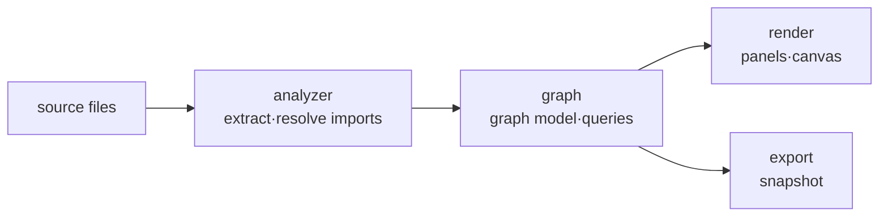

# Atlas

> `page:atlas` — code graph. Visualizes import · call · module dependencies as nodes and edges

A file tree shows only directory structure. What calls what, and which module depends on where, never surfaces in the tree. Atlas extracts those relations from source and draws them as a graph, so a developer new to a codebase can see where a file sits in the project at a glance.

> 한국어: [main.md](https://monkshark.github.io/page-ide/#internals/atlas/main.md)

---

## Structure

The module splits into four layers.



| Layer | Role |
|---|---|
| `analyzer` | Extracts imports from source with tree-sitter, resolves them to real file paths |
| `graph` | Builds relations into a node/edge model and queries it (cycles, dependent counts, etc.) |
| `render` | Draws and interacts with the graph via Compose canvas and panels |
| `export` | Exports a graph snapshot to JSON (consumed by the docs viewer widget) |

---

## analyzer — extracting and resolving imports

`ImportExtractor` pulls import statements from source using tree-sitter parsers. It detects the language by file extension and supports:

Java · Kotlin · Python · JavaScript · TypeScript · Go · Rust · Dart · C · C++ · Scala · Ruby · PHP · C# · Swift · Vue · Svelte

An extracted import is just a string; it has to be linked to a real file before it becomes an edge. `ImportResolver` handles the common cases, and languages with a package manifest get a dedicated resolver.

| Resolver | Basis |
|---|---|
| `GoModResolver` | `go.mod` module path |
| `PubspecResolver` | Dart `pubspec.yaml` package name |
| `TsConfigResolver` | `tsconfig.json` path mappings |

`DeclarationIndex` collects symbol declaration sites, and `StaticCallHierarchySource` gathers static call relations that back the call graph.

---

## graph — model and queries

`CodeGraphProvider` is the interface for graph data. `ImportGraphProvider` implements it, producing per-file and per-project slices.

```kotlin
interface CodeGraphProvider {
    fun nodesForFile(path: Path, text: String): GraphSlice
    fun nodesForProject(activePath: Path?, activeText: String?): GraphSlice
}
```

From the whole-project graph it derives dependency cycles (`projectCycles`), per-file dependent counts (`dependentCountOf`), and a dependency digest (`dependencyDigest`). `ModuleGraph` · `ModuleLayers` · `ModulePath` fold the file graph into modules to form layers, and `SymbolGraph` handles symbol-level relations.

---

## render — modules, exploration and problems

The entry composable is `AtlasContent`. Its header switches between three tabs.

| Tab (`AtlasViewTab`) | Content |
|---|---|
| `MODULES` — Modules | `OverviewCanvas` — module cards, folder drill-in, breadcrumbs and file navigation |
| `FILE` — Explore | `DependencyExplorationPanel` — expand file relationships, inspect source evidence, trace paths and potential impact |
| `PROBLEMS` — Problems | `AtlasProblemsPanel` — project cycles and highly depended-on files; select a file to explore it |

The call graph remains a separate side panel (`CallGraphPanel` · `CallsView`). Search matches file names and paths, including paths copied from an issue; Enter starts an exploration of the match. A module inspector's Explore action starts from one of its files without opening the editor.

`DependencyExploration` owns directional expansion, stable grid positions, directed path tracing, cycle groups and reverse-dependency impact. The initial view shows up to three neighbors in each direction; further expansion adds up to four at a time, with an 80-node view cap and hidden counts. Selection never rearranges existing nodes. Pan, wheel zoom and Fit control the camera. `ExplorationViewState`, held by `AtlasViewState`, retains the selection, revealed nodes and camera while Atlas closes and reopens; Back restores earlier exploration states within the running IDE session.

A → B means A uses B. Selecting a line, or Inspect source in the neighbor list, shows the actual relation kind and an analyzed source excerpt when available. Tree-sitter records a zero-based source line and the exact parsed statement in `FileAnalysis`; `ImportGraphProvider` carries that evidence through import resolution and inheritance promotion into `GraphEdge.evidence`. This is static analysis, not an execution trace or a guarantee that every runtime dependency was found. Impact highlights possible dependents, not guaranteed failures. The source excerpt is an analysis snapshot.

---

The path picker searches destination file names and paths across the analyzed graph, including files not yet visible. A direction with no path produces an explicit empty result. Potential impact labels direct dependents and hop counts, with dashed indirect connections. Cycle cards list group members without inventing an order of calls or dependencies.

## IDE integration

Atlas opens as an expanded panel (`ExpandedPanel.ATLAS`).

- Editor context menu Show in Atlas — start exploring the selected file
- Shortcut `FOCUS_IN_ATLAS` → `focusInAtlas(path)` — focus the active file in Explore
- Open file or Open source at line closes Atlas, opens the editor at the requested location, and retains the file relationship side panel
- Tab switching and panel sizing flow through MVI events (`AtlasViewTabChanged` · `ResizeAtlas` · `FocusInAtlas`)

---

## export — snapshot

`SnapshotExporter` writes the graph to a JSON snapshot. The Atlas widget in the docs viewer reads this snapshot to show the graph without a live IDE. Source excerpts are not exported; older snapshots and call graphs can have no relationship evidence.

---

- [Back to index](https://monkshark.github.io/page-ide/#README_en.md)
