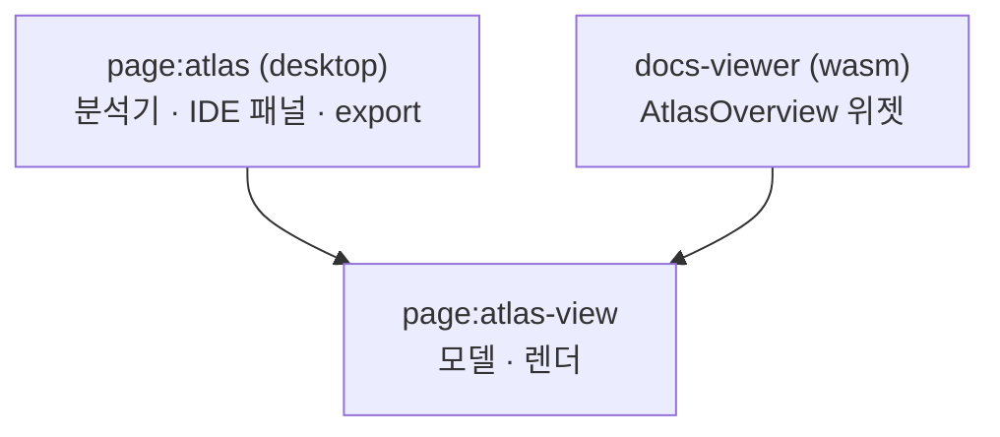

# Atlas View

> `page:atlas-view` — Atlas overview 그래프의 모델과 렌더. 데스크톱 IDE와 문서 뷰어가 공유

[Atlas](https://monkshark.github.io/page-ide/#modules/atlas/main.md) 의 overview 화면 — 모듈을 카드로 놓고 더블클릭으로 안으로 파고드는 그래프 — 는 데스크톱 IDE와 브라우저 문서 뷰어 양쪽에서 똑같이 보여야 한다. 그 렌더와 모델만 `page:atlas` 에서 뽑아 멀티플랫폼(`jvm`+`wasmJs`) 모듈로 만든 것이 `atlas-view` 다. 분석기·IDE 패널·스냅샷 export 는 데스크톱 `page:atlas` 에 그대로 남고, 여기엔 뷰에 필요한 부분만 온다. `java.nio.Path` 대신 shared-core의 [FilePath](https://monkshark.github.io/page-ide/#modules/shared-core/main.md) 를 쓴다.

> English: [main_en.md](https://monkshark.github.io/page-ide/#modules/atlas-view/main_en.md)

---

## 구성

| 패키지 | 역할 |
|---|---|
| `graph` | 파일 그래프를 모듈로 접고 계층을 분류 |
| `interaction` | 선택·드릴 상태 |
| `render` | Compose 캔버스·레이아웃·색 |

---

## graph — 파일에서 모듈로

overview 는 계층 데이터를 따로 두지 않는다. 하나의 평면 파일-level `GraphSlice` 를 `aggregateModules(slice, scopeRoot)` 로 접을 뿐이다. `scopeRoot` 를 바꿔 다시 접으면 그게 곧 드릴인이다.

```kotlin
fun aggregateModules(
    slice: GraphSlice,
    activePath: FilePath? = null,
    scopeRoot: FilePath? = null,
): ModuleGraph
```

- `ModuleNode` 는 디렉터리 하나를 접은 카드다 — 파일 수, 언어, 하위 파일 목록, 그리고 더 들어갈 데가 있는지(`splittable`).
- `classifyModuleLayers` 는 모듈을 의존 깊이로 다섯 층(`ENTRY` · `FEATURES` · `CORE` · `PLATFORM` · `EXTERNAL`)에 배정한다.
- `AtlasSnapshot.parse(json)` 는 내보낸 평면 스냅샷(노드 `id` == 레포 상대 경로)을 읽어 `FilePath` 를 복원한다.

---

## interaction — 드릴 상태

`OverviewSelection` 이 선택과 드릴 경로를 함께 들고 있다.

- `drillInto(id)` — splittable 모듈로 한 겹 들어감
- `drillUpTo(depth)` — 브레드크럼으로 특정 깊이까지 나옴
- `selectModule` · `tracePath` — 카드 선택과 경로 하이라이트

`drillPath` 의 마지막 원소가 곧 `aggregateModules` 의 `scopeRoot` 가 된다.

---

## render — 캔버스

`OverviewCanvas` 가 모듈 그래프를 그린다. 카드는 층 컬럼에 놓이고(`layeredModuleLayout`), 휠 확대·드래그 이동은 `MapViewState` 가, 순환 엣지 표시는 `MapCycles` 가 맡는다. splittable 모듈을 더블클릭하면 애니메이션 줌으로 그 안으로 들어가고, 단일 파일이면 `onOpenFile` 로 연다.

색은 `AtlasRoleColors` 로 주입받는다. 데스크톱은 Glass 토큰을, 문서 뷰어는 자기 테마를 넣어, 같은 렌더가 양쪽 테마에 맞춰 돈다.

---

## 두 호스트



데스크톱은 라이브 분석 결과를, 문서 뷰어는 내보낸 스냅샷을 같은 `OverviewCanvas` 에 흘려보낸다.

---

- [Atlas 모듈 보기](https://monkshark.github.io/page-ide/#modules/atlas/main.md)
- [목차로 돌아가기](https://monkshark.github.io/page-ide/#README_kr.md)
