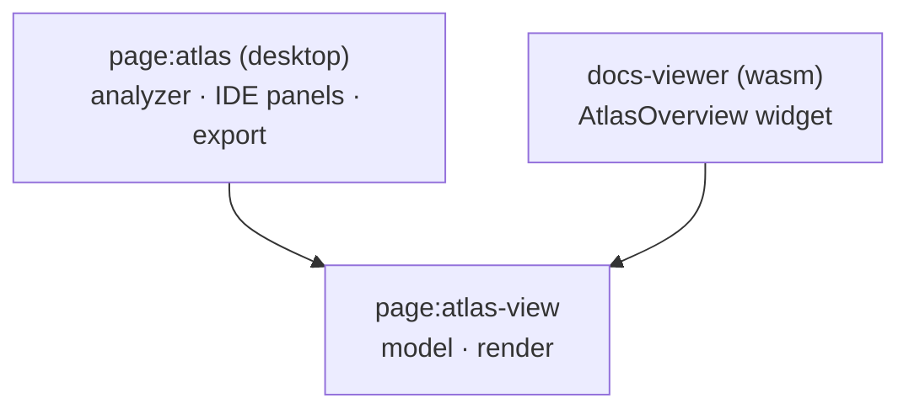

# Atlas View

> `page:atlas-view` — the Atlas overview graph's model and render, shared by the desktop IDE and the docs viewer

The [Atlas](https://monkshark.github.io/page-ide/#modules/atlas/main_en.md) overview — modules laid out as cards you double-click to drill into — must look identical in the desktop IDE and in the browser docs viewer. `atlas-view` is that render and model pulled out of `page:atlas` into a multiplatform (`jvm`+`wasmJs`) module. The analyzer, IDE panels, and snapshot export stay in desktop `page:atlas`; only the view-facing parts come here. It uses shared-core's [FilePath](https://monkshark.github.io/page-ide/#modules/shared-core/main_en.md) instead of `java.nio.Path`.

> 한국어: [main.md](https://monkshark.github.io/page-ide/#modules/atlas-view/main.md)

---

## Structure

| Package | Role |
|---|---|
| `graph` | Folds the file graph into modules and classifies layers |
| `interaction` | Selection / drill state |
| `render` | Compose canvas / layout / colors |

---

## graph — from files to modules

The overview keeps no separate hierarchy data. It just folds one flat, file-level `GraphSlice` with `aggregateModules(slice, scopeRoot)`. Re-folding with a different `scopeRoot` is the drill-in.

```kotlin
fun aggregateModules(
    slice: GraphSlice,
    activePath: FilePath? = null,
    scopeRoot: FilePath? = null,
): ModuleGraph
```

- A `ModuleNode` is one folded directory — its file count, language, sub-file list, and whether there is more to drill into (`splittable`).
- `classifyModuleLayers` assigns each module to one of five dependency-depth layers (`ENTRY`, `FEATURES`, `CORE`, `PLATFORM`, `EXTERNAL`).
- `AtlasSnapshot.parse(json)` reads the exported flat snapshot (node `id` == repo-relative path) and restores a `FilePath`.

---

## interaction — drill state

`OverviewSelection` carries both the selection and the drill path.

- `drillInto(id)` — descend one level into a splittable module
- `drillUpTo(depth)` — climb back to a given depth via the breadcrumb
- `selectModule` · `tracePath` — card selection and path highlighting

The last element of `drillPath` becomes the `scopeRoot` for `aggregateModules`.

---

## render — canvas

`OverviewCanvas` draws the module graph. Cards are placed into layer columns (`layeredModuleLayout`); `MapViewState` handles scroll-zoom and drag-pan, and `MapCycles` marks cycle edges. Double-clicking a splittable module zooms in with animation; a single file opens via `onOpenFile`.

Colors are injected through `AtlasRoleColors`. Desktop passes Glass tokens, the docs viewer passes its own theme, so the same render adapts to either.

---

## Two hosts



Desktop feeds live analysis results; the docs viewer feeds an exported snapshot — both into the same `OverviewCanvas`.

---

- [See the Atlas module](https://monkshark.github.io/page-ide/#modules/atlas/main_en.md)
- [Back to index](https://monkshark.github.io/page-ide/#README_en.md)
