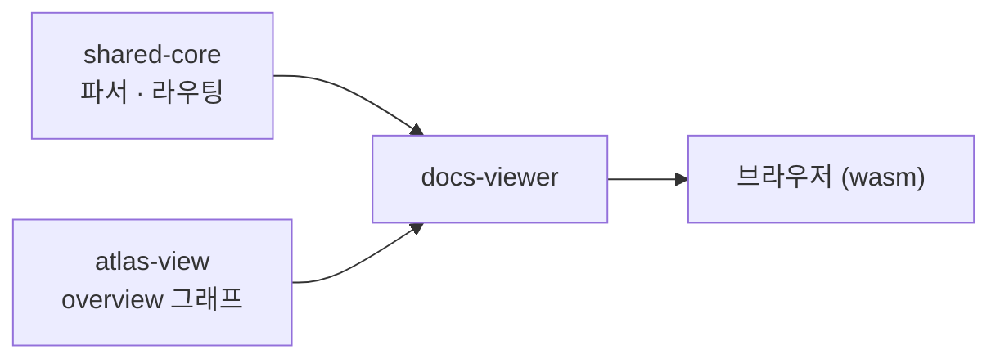

# Docs Viewer

> `docs-viewer` — 이 문서 사이트를 그리는 Compose wasmJs 앱과, 산문 안에 얹는 위젯 섬

지금 보고 있는 문서 사이트는 두 갈래로 그려진다. 기본 `index.html` 은 마크다운을 HTML로 옮겨 그리는 가벼운 산문 뷰어다(`build_viewer.js` 산출물). 그 위에, 정적 텍스트로는 부족한 자리 — 이를테면 드릴다운되는 Atlas overview — 를 위해 Compose를 wasm으로 컴파일한 위젯 섬을 얹는다. `docs-viewer` 는 그 Compose/wasm 쪽이다.

`java.*` 없이 [shared-core](https://monkshark.github.io/page-ide/#modules/shared-core/main.md) 의 파서·라우팅과 [atlas-view](https://monkshark.github.io/page-ide/#modules/atlas-view/main.md) 의 그래프를 그대로 조립한다.

> English: [main_en.md](https://monkshark.github.io/page-ide/#modules/docs-viewer/main_en.md)

---

## 두 진입점

`Main.kt` 에 두 갈래가 있다.

```kotlin
fun main() { … DocsApp() … }

@JsExport
fun mountPageWidget(containerId: String, name: String)
```

- `main()` 은 `DocsApp` 으로 문서 사이트 전체를 Compose로 그린다.
- `mountPageWidget` 은 등록된 위젯 하나를 특정 컨테이너에 마운트한다. UMD 글로벌(`window["docs-viewer"].mountPageWidget`)로 노출돼, 플레인 `<script>` 만으로 산문 페이지 안에 섬을 꽂을 수 있다.

---

## DocsApp — 전부 Compose로

`DocsApp` 은 `docs-index.json` 과 `docs/<path>.md` 를 런타임에 가져와(`fetchText`) 그린다.

| 조각 | 역할 |
|---|---|
| `DocTreeSidebar` | `buildDocTree` 로 접은 좌측 문서 트리 |
| `Article` | `MdParser` 트리를 Compose로 렌더 |
| `HeadingRail` | 헤딩 3개 이상이면 우측 목차 + 스크롤스파이 |
| `DocsTheme` | 다크·라이트 토큰, 토글 |
| `HashRouter` | `#path#heading` URL 해시 ↔ 화면 상태 |

한국어·영어 전환은 shared-core의 `_en` 변형 규칙(`variantFor`)을 그대로 쓴다.

---

## 위젯 섬

`PageWidgets` 는 이름 → 컴포저블 레지스트리다. `registerPageWidgets()` 가 두 개를 등록한다.

| 위젯 | 내용 |
|---|---|
| `AtlasDemo` | shared-core `GraphCanvas` 로 그린 정적 파일 그래프 |
| `AtlasOverview` | atlas-view `OverviewCanvas` — 층 컬럼 + 더블클릭 드릴다운 |

`AtlasOverview` 는 `atlas-snapshot.json`(평면 파일-level)을 가져와 `AtlasSnapshot.parse` 로 읽고, `aggregateModules(scopeRoot = 드릴 경로)` 로 접어 그린다. 색은 `DocsTheme` 를 `AtlasRoleColors` 로 넣어 문서 테마에 맞춘다. `mountPageWidget("box", "AtlasOverview")` 한 줄이면 산문 어디에나 이 그래프가 뜬다.

---

## 조립층

`docs-viewer` 자체 로직은 얇다. 마크다운 파싱·문서 라우팅은 shared-core, overview 그래프는 atlas-view가 이미 갖고 있고, 이 모듈은 그것들을 wasm 화면으로 엮는다.



---

- [shared-core 보기](https://monkshark.github.io/page-ide/#modules/shared-core/main.md)
- [목차로 돌아가기](https://monkshark.github.io/page-ide/#README_kr.md)
