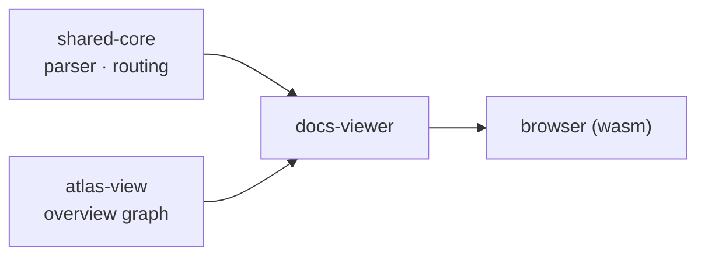

# Docs Viewer

> `docs-viewer` — the Compose wasmJs app that renders this docs site, plus the widget islands laid over the prose

The docs site you are reading is drawn two ways. The default `index.html` is a light prose viewer that turns markdown into HTML (the output of `build_viewer.js`). On top of it, where static text is not enough — a drill-down Atlas overview, say — it lays widget islands compiled from Compose to wasm. `docs-viewer` is that Compose/wasm side.

With no `java.*`, it assembles [shared-core](https://monkshark.github.io/page-ide/#modules/shared-core/main_en.md)'s parser and routing together with [atlas-view](https://monkshark.github.io/page-ide/#modules/atlas-view/main_en.md)'s graph.

> 한국어: [main.md](https://monkshark.github.io/page-ide/#modules/docs-viewer/main.md)

---

## Two entry points

`Main.kt` has two paths.

```kotlin
fun main() { … DocsApp() … }

@JsExport
fun mountPageWidget(containerId: String, name: String)
```

- `main()` renders the entire docs site in Compose via `DocsApp`.
- `mountPageWidget` mounts a single registered widget into a given container. Exposed as a UMD global (`window["docs-viewer"].mountPageWidget`), it lets a plain `<script>` drop an island into a prose page.

---

## DocsApp — all in Compose

`DocsApp` fetches `docs-index.json` and `docs/<path>.md` at runtime (`fetchText`) and renders them.

| Piece | Role |
|---|---|
| `DocTreeSidebar` | Left doc tree folded by `buildDocTree` |
| `Article` | Renders the `MdParser` tree in Compose |
| `HeadingRail` | Right-side table of contents + scrollspy when there are 3+ headings |
| `DocsTheme` | Dark / light tokens and the toggle |
| `HashRouter` | `#path#heading` URL hash ↔ view state |

Korean / English switching reuses shared-core's `_en` variant rule (`variantFor`).

---

## Widget islands

`PageWidgets` is a name → composable registry. `registerPageWidgets()` registers two.

| Widget | Content |
|---|---|
| `AtlasDemo` | A static file graph drawn with shared-core `GraphCanvas` |
| `AtlasOverview` | atlas-view `OverviewCanvas` — layer columns + double-click drill-down |

`AtlasOverview` fetches `atlas-snapshot.json` (flat, file-level), reads it with `AtlasSnapshot.parse`, and folds it with `aggregateModules(scopeRoot = drill path)`. Colors come from `DocsTheme` passed as `AtlasRoleColors`, matching the doc theme. A single `mountPageWidget("box", "AtlasOverview")` puts this graph anywhere in the prose.

---

## An assembly layer

`docs-viewer`'s own logic is thin. Markdown parsing and doc routing already live in shared-core, the overview graph in atlas-view; this module wires them into a wasm screen.



---

- [See shared-core](https://monkshark.github.io/page-ide/#modules/shared-core/main_en.md)
- [Back to index](https://monkshark.github.io/page-ide/#README_en.md)
