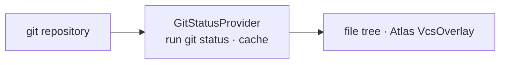

# Git

> `page:git` — the workspace VCS status. Reads `git status` to report per-file change kinds

The editor tree and the Atlas graph both need to show whether a file has changed against the last commit. This module is the single source for that decision. It runs `git status` over a Git repository, extracts a per-file change kind, and caches the result briefly so several views share one snapshot.

> 한국어: [main.md](https://monkshark.github.io/page-ide/#modules/git/main.md)

---

## Structure

The module is thin: one interface, one implementation.



| Element | Role |
|---|---|
| `VcsStatusProvider` | Query interface (`statuses()` · `refresh()`) |
| `GitStatusKind` | Change-kind enum (MODIFIED · ADDED · DELETED · RENAMED · UNTRACKED) |
| `GitStatusProvider` | Implementation that runs `git status` and keeps the result in a TTL cache |
| `parseGitStatus` | Parses porcelain output into a path → kind map |

---

## Querying status

`VcsStatusProvider` separates the consumer of status from its producer.

```kotlin
interface VcsStatusProvider {
    fun statuses(): Map<Path, GitStatusKind>
    fun refresh()
}
```

`statuses()` returns a map keyed by absolute path (relative to the workspace root) with the change kind as the value. A tree row or a graph node looks up its own path in this map to draw a badge.

---

## GitStatusProvider — running and caching

The implementation runs `git status --porcelain=v1 -z` as a subprocess. Rather than a library like JGit, it calls the system `git` executable directly, so it honors exactly the same Git config, credentials, and ignore rules the user already uses.

Because many views ask for the same status at once, the result is held in a TTL cache (30 seconds by default, `ttlMs`). While the cache is warm, `statuses()` returns immediately without re-spawning the process. When an edit is saved or the stage changes and a fresh read is needed, `refresh()` clears the cache.

The constructor takes `clock` and `runGit` as parameters, so tests can inject an output string and a time source without launching a real process.

---

## parseGitStatus — parsing porcelain

Output from the `-z` flag is NUL-delimited, with each entry beginning with a two-character status code. `parseGitStatus(output, root)` walks these entries, maps each code to a `GitStatusKind`, and normalizes the path to an absolute path under the root. Renamed entries (`R`) arrive with both an origin and a target path, so that form is handled too.

---

- [Back to index](https://monkshark.github.io/page-ide/#README_en.md)
