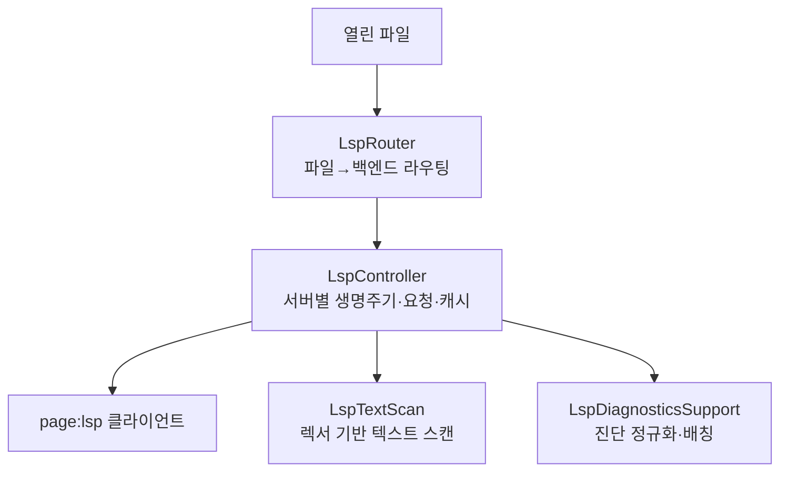

# Language

> `page:language` — 언어 지능 오케스트레이션. 파일을 서버에 잇고, 문서 동기화·완성·진단의 생명주기를 관리

[`page:lsp`](https://monkshark.github.io/page-ide/#modules/lsp/main.md)가 서버와 말하는 프로토콜 층이라면, 이 모듈은 그 위에서 IDE가 실제로 쓰는 오케스트레이션 층이다. 열린 파일을 알맞은 서버로 라우팅하고, 문서 변경을 debounce로 밀어 넣고, 완성 결과를 캐시하고, 서버가 못 주는 결과는 텍스트 스캔으로 메운다.

> English: [main_en.md](https://monkshark.github.io/page-ide/#modules/language/main_en.md)

---

## 구성

| 요소 | 역할 |
|---|---|
| `LspRouter` | 파일 확장자로 백엔드를 골라 백엔드별 컨트롤러를 lazy 생성·공유 |
| `LspController` | 한 언어 서버의 생명주기와 모든 요청, 캐시, capability를 관리 |
| `LspServerCapabilities` | 서버 capability에서 지원 기능을 감지 |
| `LspDiagnosticsSupport` | 진단 URI 정규화·배칭·lsp4j 변환 |
| `LspTextScan` | 로컬 참조·이름 변경용 렉서 텍스트 스캔 |

---

## LspRouter — 파일에서 서버로

`LspRouter(workspaceRoot, parentScope)`는 열린 파일을 알맞은 백엔드로 잇는다. `LspBackends.forFile`로 파일의 백엔드를 판정하고, 백엔드 id마다 `LspController`를 하나씩 `getOrPut`으로 만들어 재사용한다. Kotlin 파일 열 때 뜬 KLS 컨트롤러는 다음 Kotlin 파일에도 그대로 쓰인다.

Compose에서는 `rememberLspRouter(workspaceRoot)`로 라우터를 워크스페이스 수명에 묶는다. 파일 이름 변경은 `notifyFilesRenamed`로 서버에 알리고, 전체 재시작·종료도 라우터가 관장한다. 여러 서버의 진단은 `allDiagnosticsByUri`로 합쳐 에디터가 한곳에서 읽는다.

---

## LspController — 서버별 오케스트레이션

`LspController(workspaceRoot, scope)`가 이 모듈의 핵심이다. 한 언어 서버의 상태(`IDLE` · `STARTING` · `READY` · `MISSING` · `FAILED`)를 들고, 서버가 뜨는 동안 진행 상황과 타임아웃을 추적한다.

문서 동기화는 `didOpen` · `didChange` · `didSave` · `didClose`로 흐른다. 타건마다 서버를 때리지 않도록 `didChange`는 250ms debounce로 묶는다. 그 위에 IDE 기능 전부가 요청으로 올라간다.

| 기능 | 보강 |
|---|---|
| 완성(completion) | 결과 캐시 + 접두어 연장 재사용, 키워드·import 후보 병합, 접두어 정렬 |
| 정의·참조 | 서버 결과 + 로컬 심볼은 텍스트 스캔으로 보완 |
| 심볼·콜 계층 | 문서 심볼, prepare/incoming/outgoing 호출 |
| 코드 액션 | 서버 액션 + `PageQuickFixes` 합성 |
| 인레이 힌트·시그니처 | 힌트 캐시, 시그니처 도움말 |
| 이름 변경 | `prepareRename` + 서버 미지원 시 텍스트 스캔 폴백 |

서버가 어떤 기능을 지원하는지는 `LspServerCapabilities`가 초기화 응답에서 감지해 플래그로 들고, 미지원 기능은 요청조차 보내지 않는다. Java처럼 컴파일러 정책을 요구하는 서버에는 `java.project.updateSettings` 같은 설정을 실어 보낸다.

---

## 텍스트 스캔과 진단 정규화

서버가 로컬 변수·비공개 심볼의 참조를 다 주지 못하는 경우가 있다. `LspTextScan`은 에디터 렉서로 소스를 훑어 워드 경계를 맞추고, 문자열·주석 구간을 제외하고, 감싸는 함수 범위를 찾아 로컬 참조와 이름 변경 범위를 보완한다.

`LspDiagnosticsSupport`는 진단을 IDE가 쓰기 좋게 정규화한다. Windows에서 드라이브 문자 대소문자가 어긋나 진단이 엉뚱한 URI에 붙는 문제를 `canonicalUri`로 바로잡고, 쏟아지는 진단을 배치로 묶어 흘린다.

---

- [목차로 돌아가기](https://monkshark.github.io/page-ide/#README_kr.md)
