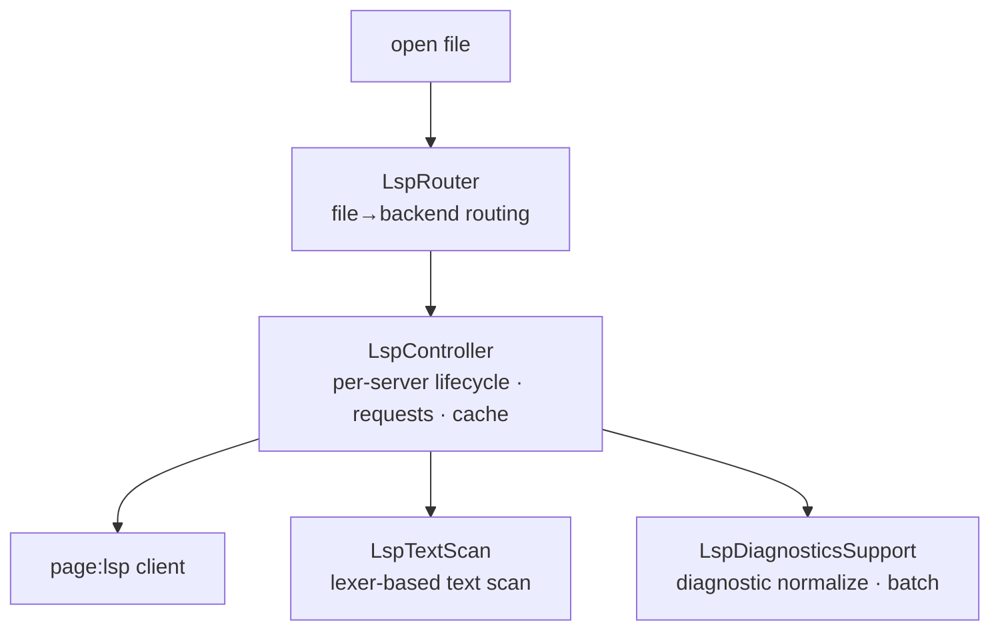

# Language

> `page:language` — language-intelligence orchestration. Routes files to servers and manages the lifecycle of document sync, completion, and diagnostics

If [`page:lsp`](https://monkshark.github.io/page-ide/#modules/lsp/main_en.md) is the protocol layer that talks to servers, this module is the orchestration layer the IDE actually uses on top of it. It routes open files to the right server, pushes document changes through with debouncing, caches completion results, and fills gaps the server cannot answer with text scanning.

> 한국어: [main.md](https://monkshark.github.io/page-ide/#modules/language/main.md)

---

## Structure

| Element | Role |
|---|---|
| `LspRouter` | Picks a backend by file extension and lazily creates/shares a per-backend controller |
| `LspController` | Manages one language server's lifecycle, all requests, caches, and capabilities |
| `LspServerCapabilities` | Detects supported features from server capabilities |
| `LspDiagnosticsSupport` | Normalizes diagnostic URIs, batches them, converts lsp4j |
| `LspTextScan` | Lexer-based text scan for local references and rename |

---

## LspRouter — from file to server

`LspRouter(workspaceRoot, parentScope)` binds an open file to the right backend. It decides the file's backend via `LspBackends.forFile` and creates one `LspController` per backend id with `getOrPut`, reusing it. The KLS controller spawned when opening a Kotlin file is reused for the next Kotlin file.

In Compose, `rememberLspRouter(workspaceRoot)` ties the router to the workspace lifetime. File renames are announced to the server via `notifyFilesRenamed`, and full restart and shutdown are also governed by the router. Diagnostics from multiple servers are merged into `allDiagnosticsByUri` so the editor reads them from one place.

---

## LspController — per-server orchestration

`LspController(workspaceRoot, scope)` is the heart of this module. It holds one language server's state (`IDLE` · `STARTING` · `READY` · `MISSING` · `FAILED`) and tracks progress and timeouts while the server comes up.

Document sync flows through `didOpen` · `didChange` · `didSave` · `didClose`. To avoid hitting the server on every keystroke, `didChange` is coalesced with a 250 ms debounce. On top of that, every IDE feature rides as a request.

| Feature | Augmentation |
|---|---|
| Completion | Result cache + prefix-extend reuse, keyword/import candidate merge, prefix sort |
| Definition · references | Server result + local symbols filled in by text scan |
| Symbols · call hierarchy | Document symbols, prepare/incoming/outgoing calls |
| Code actions | Server actions + `PageQuickFixes` synthesis |
| Inlay hints · signature | Hint cache, signature help |
| Rename | `prepareRename` + text-scan fallback when unsupported |

Which features a server supports is detected from the initialize response by `LspServerCapabilities` and held as flags; unsupported features are never even requested. Servers that require a compiler policy, like Java, are sent settings such as `java.project.updateSettings`.

---

## Text scan and diagnostic normalization

Sometimes a server cannot report every reference to a local variable or private symbol. `LspTextScan` walks the source with the editor lexer, aligning word boundaries, excluding string and comment ranges, and finding the enclosing function range to fill in local references and rename ranges.

`LspDiagnosticsSupport` normalizes diagnostics into a form the IDE can use. It fixes, via `canonicalUri`, the case where a mismatched Windows drive-letter case attaches diagnostics to the wrong URI, and it batches bursts of diagnostics before flushing them.

---

- [Back to index](https://monkshark.github.io/page-ide/#README_en.md)
