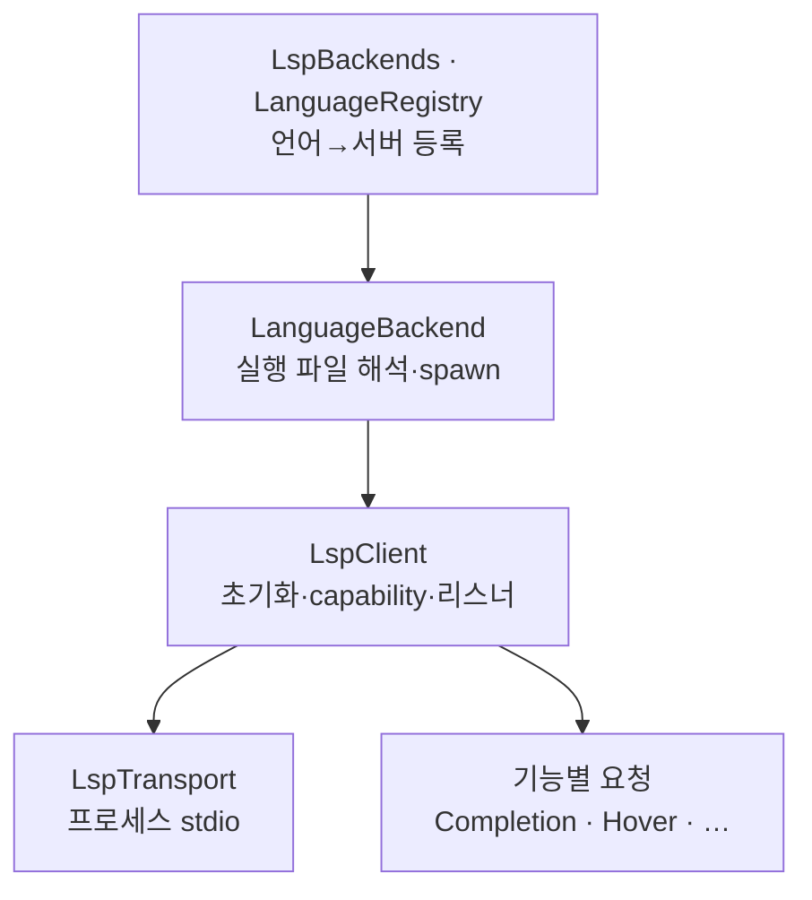

# LSP

> `page:lsp` — Language Server Protocol 클라이언트 층. 서버를 띄우고, 프로토콜로 말하고, 언어별 백엔드를 등록

코드 완성·정의 이동·진단은 언어마다 다른 서버가 만든다. 이 모듈은 그 서버들과 LSP로 대화하는 클라이언트 층이다. 서버 프로세스를 띄우는 전송, 초기화와 요청을 처리하는 클라이언트, 언어를 서버에 잇는 백엔드, 그리고 완성·호버·정의 같은 기능별 요청 빌더로 나뉜다.

상위 IDE 오케스트레이션(컨트롤러 생명주기·라우팅·캐시)은 [`page:language`](https://monkshark.github.io/page-ide/#modules/language/main.md)가 이 층 위에 얹는다.

> English: [main_en.md](https://monkshark.github.io/page-ide/#modules/lsp/main_en.md)

---

## 구성



| 층 | 역할 |
|---|---|
| 등록 | `LanguageBackend`/`LspBackends`, `LanguageRegistry`/`LanguageDefinition` — 어떤 확장자를 어떤 서버가 맡는지 |
| 클라이언트 | `LspClient` — lsp4j `LanguageClient` 구현, 초기화·capability·서버 알림 수신 |
| 전송 | `LspTransport`(`StreamTransport`·`ProcessTransport`) — 서버 프로세스의 stdin/stdout |
| 기능 | `Completion`·`Hover`·`Definition`·`References`·`Rename`·`SignatureHelp`·`Symbols`·`CallHierarchy`·`InlayHints`·`CodeActions`·`Diagnostic` 등 요청 빌더 |
| 보강 | `CompletionProfile`·`CompletionAugmentor`·`PageQuickFixes` — 서버 응답에 키워드·import·퀵픽스를 더함 |

---

## 백엔드 등록

`LanguageBackend`는 한 언어를 서버에 잇는 인터페이스다.

```kotlin
interface LanguageBackend {
    val id: String
    val displayName: String
    fun supports(extension: String?): Boolean
    fun resolveExecutable(env: Map<String, String>): Resolution
    fun spawn(executable: Path, workspaceRoot: Path?, ...): LspClient
}
```

`resolveExecutable`은 서버 실행 파일을 찾아 `Found`/`NotFound`를 돌려주고, `spawn`은 그 실행 파일로 프로세스를 띄워 연결된 `LspClient`를 만든다. `LspBackends`는 등록된 백엔드를 모아 파일 경로로 알맞은 백엔드를 고른다(`forFile`). 라우팅을 가로챌 필요가 있으면 `routingInterceptor`로 확장자 기본 규칙보다 먼저 판정을 끼워 넣는다.

언어의 정적 메타데이터(확장자, 서버 바이너리 이름, OS별 설치 안내, 실행 인자)는 `LanguageRegistry`가 리소스의 `languages.json`을 읽어 `LanguageDefinition` 목록으로 제공한다. 코드가 아니라 데이터로 언어를 늘릴 수 있게 한 지점이다.

---

## LspClient — 클라이언트와 초기화

`LspClient`는 lsp4j `LanguageClient`를 구현한다. `start()`는 런처를 만들어 서버 프록시를 얻고, `initialize`로 클라이언트 capability를 알린다. 완성 스니펫·resolve, 코드 액션 리터럴·resolve, 콜 계층, 진단 태그(`Unnecessary`·`Deprecated`), `applyEdit`, 작업 진행률(work-done progress)까지 선언해 서버 기능을 최대한 끌어 쓴다.

서버가 보내는 비동기 알림은 리스너로 흘린다. `onDiagnostics`·`onLogMessage`·`onShowMessage`·`onProgress`·`onApplyEdit`로 구독한다. 상태는 `LspState`로 관리하고, 종료는 정상 `shutdown()`과 강제 `forceClose()` 두 갈래다. JDT-LS의 비표준 알림(`language/status` 등)도 조용히 받아 넘긴다.

---

## LspTransport — 프로세스 stdio

`ProcessTransport`는 서버 프로세스의 stdin/stdout을 클라이언트에 잇고, stderr는 데몬 스레드로 퍼 올려 로그로 흘린다. 종료 시 프로세스 트리를 정리하는데, Windows에서는 `taskkill /F /T`로 자식까지 강제 종료하고, 그 외 OS에서는 자손 프로세스를 destroy한다. 서버가 좀비로 남지 않게 하는 지점이다.

---

## 기능별 요청과 보강

완성·호버·정의·참조·이름 변경·시그니처 도움말·심볼·콜 계층·인레이 힌트·코드 액션·진단은 각각 파일로 나뉘어 lsp4j 요청을 만들고 응답을 IDE가 쓰기 좋은 형태로 옮긴다.

서버 응답만으로 부족한 부분은 이 층에서 보강한다. `CompletionProfile`은 언어별 키워드 셋과 auto-import 지원 여부를 담고, `CompletionAugmentor`는 완성 목록에 키워드와 (워크스페이스 심볼로 찾은) import 후보를 끼워 넣는다. `PageQuickFixes`는 서버가 주지 않는 퀵픽스를 합성한다. `CompletionFrecency`는 자주·최근 고른 항목을 위로 올린다.

---

- [목차로 돌아가기](https://monkshark.github.io/page-ide/#README_kr.md)
