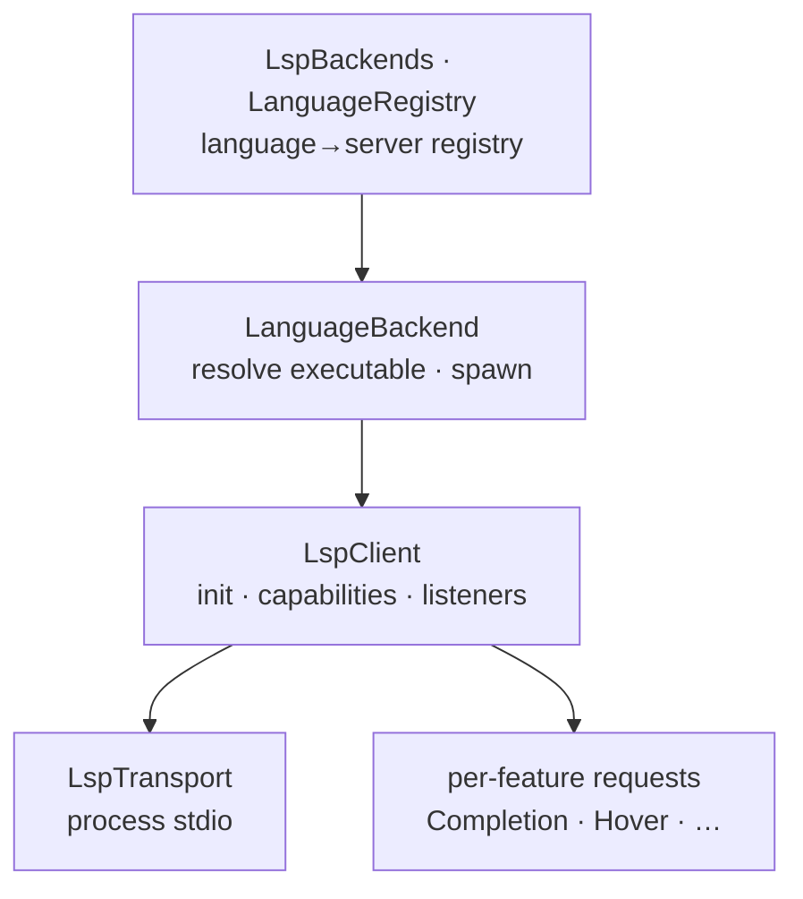

# LSP

> `page:lsp` — the Language Server Protocol client layer. Spawns servers, speaks the protocol, and registers per-language backends

Completion, go-to-definition, and diagnostics are produced by a different server for each language. This module is the client layer that talks to those servers over LSP. It divides into the transport that spawns the server process, the client that handles initialization and requests, the backend that binds a language to a server, and per-feature request builders for completion, hover, definition, and the rest.

The higher-level IDE orchestration (controller lifecycle, routing, caching) sits on top of this layer in [`page:language`](https://monkshark.github.io/page-ide/#modules/language/main_en.md).

> 한국어: [main.md](https://monkshark.github.io/page-ide/#modules/lsp/main.md)

---

## Structure



| Layer | Role |
|---|---|
| Registry | `LanguageBackend`/`LspBackends`, `LanguageRegistry`/`LanguageDefinition` — which extension is served by which server |
| Client | `LspClient` — lsp4j `LanguageClient` implementation: init, capabilities, receiving server notifications |
| Transport | `LspTransport` (`StreamTransport` · `ProcessTransport`) — the server process's stdin/stdout |
| Features | `Completion` · `Hover` · `Definition` · `References` · `Rename` · `SignatureHelp` · `Symbols` · `CallHierarchy` · `InlayHints` · `CodeActions` · `Diagnostic` request builders |
| Augmentation | `CompletionProfile` · `CompletionAugmentor` · `PageQuickFixes` — add keywords, imports, and quick fixes to server responses |

---

## Registering backends

`LanguageBackend` is the interface that binds one language to a server.

```kotlin
interface LanguageBackend {
    val id: String
    val displayName: String
    fun supports(extension: String?): Boolean
    fun resolveExecutable(env: Map<String, String>): Resolution
    fun spawn(executable: Path, workspaceRoot: Path?, ...): LspClient
}
```

`resolveExecutable` locates the server executable and returns `Found`/`NotFound`; `spawn` launches a process from that executable and produces a connected `LspClient`. `LspBackends` collects registered backends and picks the right one for a file path (`forFile`). When routing needs to be overridden, `routingInterceptor` injects a decision ahead of the default extension rule.

A language's static metadata (extensions, server binary names, per-OS install guidance, launch args) comes from `LanguageRegistry`, which reads `languages.json` from resources into a list of `LanguageDefinition`. This is where languages can be added as data rather than code.

---

## LspClient — the client and initialization

`LspClient` implements the lsp4j `LanguageClient`. `start()` builds a launcher, obtains the server proxy, and announces client capabilities via `initialize`. It declares completion snippet/resolve, code-action literal/resolve, call hierarchy, diagnostic tags (`Unnecessary` · `Deprecated`), `applyEdit`, and work-done progress, to draw on as much server capability as possible.

Asynchronous notifications from the server flow to listeners: subscribe with `onDiagnostics` · `onLogMessage` · `onShowMessage` · `onProgress` · `onApplyEdit`. State is tracked with `LspState`, and shutdown has two paths — a graceful `shutdown()` and a forced `forceClose()`. JDT-LS's non-standard notifications (`language/status`, etc.) are quietly accepted and ignored.

---

## LspTransport — process stdio

`ProcessTransport` wires the server process's stdin/stdout to the client, and pumps stderr on a daemon thread into the log. On close it cleans up the process tree: on Windows it force-kills children with `taskkill /F /T`, and on other systems it destroys descendant processes. This is what keeps servers from lingering as zombies.

---

## Per-feature requests and augmentation

Completion, hover, definition, references, rename, signature help, symbols, call hierarchy, inlay hints, code actions, and diagnostics each live in their own file, building the lsp4j request and translating the response into a form the IDE can use.

Where the server response alone is not enough, this layer augments it. `CompletionProfile` holds the per-language keyword set and whether auto-import is supported; `CompletionAugmentor` folds keywords and import candidates (found via workspace symbols) into the completion list. `PageQuickFixes` synthesizes quick fixes the server does not provide. `CompletionFrecency` promotes frequently and recently chosen items.

---

- [Back to index](https://monkshark.github.io/page-ide/#README_en.md)
