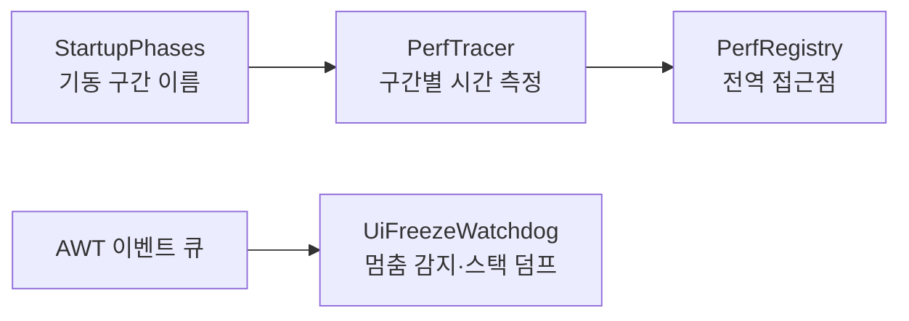

# Perf

> `page:perf` — 시작 성능 계측과 UI 멈춤 감시. 기동 구간의 시간을 재고, 이벤트 스레드가 막히면 스택을 덤프

IDE에서 "느리다"는 대개 두 가지다. 켜는 데 오래 걸리거나, 켠 뒤 순간순간 멈춘다. 이 모듈은 그 둘을 각각 다룬다. `PerfTracer`는 기동 단계의 소요 시간을 이름 붙여 기록하고, `UiFreezeWatchdog`는 UI 스레드가 일정 시간 이상 막히면 그 순간의 스택을 뽑아 원인을 남긴다.

> English: [main_en.md](https://monkshark.github.io/page-ide/#modules/perf/main_en.md)

---

## 구성

| 요소 | 역할 |
|---|---|
| `PerfTracer` | 구간을 begin/end로 감싸 소요 시간을 모으고 요약 |
| `PerfMark` | 한 구간의 측정 결과 (phase · startMs · endMs · durationMs) |
| `StartupPhases` | 기동 단계 이름 상수 모음 |
| `StartupKind` | 콜드/웜 시작 구분 (COLD · WARM) |
| `PerfRegistry` | 어디서든 트레이서에 접근하는 전역 진입점 |
| `UiFreezeWatchdog` | 이벤트 스레드 멈춤을 감시하고 스택을 덤프 |

---

## PerfTracer — 기동 구간 측정

`PerfTracer`는 구간을 이름으로 열고 닫는다. `begin(phase)`로 시작 시각을 찍고 `end(phase)`로 종료 시각을 찍으면 `PerfMark` 하나가 쌓인다. 블록을 감싸는 `trace(phase) { ... }` 형태도 있다. `snapshot()`은 지금까지의 마크 목록을, `summary()`는 사람이 읽을 요약 문자열을 돌려준다.

측정 대상 구간은 `StartupPhases`에 상수로 고정돼 있어, 코드 여러 곳에서 같은 이름으로 같은 지점을 가리킨다.

| 단계 | 의미 |
|---|---|
| `COMPOSE_INIT` | Compose 런타임 초기화 |
| `WINDOW_SHOWN` | 첫 윈도우 표시 |
| `FIRST_FRAME` | 첫 프레임 렌더 |
| `WORKSPACE_OPEN` | 워크스페이스 열기 |
| `WORKSPACE_INDEX_BUILT` | 파일 인덱스 구축 완료 |
| `WORKSPACE_FIRST_TAB_VISIBLE` | 첫 탭이 보이는 시점 |
| `LSP_SPAWNED` | 언어 서버 기동 |
| `LSP_FIRST_DIAGNOSTIC` | 첫 진단 도착 |

콜드 스타트와 웜 스타트는 성격이 다르므로 `StartupKind`로 구분해 기록한다. 전역 접근이 필요한 곳은 `PerfRegistry`를 거쳐 같은 트레이서를 공유한다.

---

## UiFreezeWatchdog — 멈춤 감시

Compose Desktop은 AWT 이벤트 스레드 위에서 돈다. 이 스레드가 오래 막히면 화면 전체가 얼어붙는다. `UiFreezeWatchdog.start(thresholdMs = 3000)`는 데몬 스레드를 최고 우선순위로 띄워 AWT 이벤트 큐에 주기적으로 핑을 보낸다. 핑이 임계 시간 안에 처리되지 않으면 UI 스레드를 막고 있는 지점의 스택 트레이스를 덤프한다. 원인 코드를 사후에 지목하기 위한 진단 도구다.

---

- [목차로 돌아가기](https://monkshark.github.io/page-ide/#README_kr.md)
