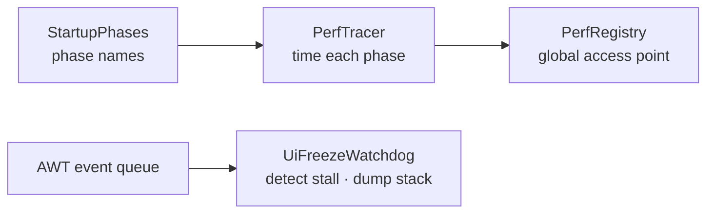

# Perf

> `page:perf` — startup instrumentation and a UI-freeze watchdog. Times the boot phases, and dumps stacks when the event thread stalls

"Slow" in an IDE usually means one of two things: it takes too long to open, or it hitches after it opens. This module addresses each. `PerfTracer` records named durations for boot phases, and `UiFreezeWatchdog` captures the current stack when the UI thread is blocked beyond a threshold, so the cause is on the record.

> 한국어: [main.md](https://monkshark.github.io/page-ide/#modules/perf/main.md)

---

## Structure

| Element | Role |
|---|---|
| `PerfTracer` | Wraps a phase in begin/end to collect durations and summarize |
| `PerfMark` | One phase's measurement (phase · startMs · endMs · durationMs) |
| `StartupPhases` | Constants for the boot phase names |
| `StartupKind` | Cold vs. warm start (COLD · WARM) |
| `PerfRegistry` | Global entry point to reach the tracer from anywhere |
| `UiFreezeWatchdog` | Watches for event-thread stalls and dumps stacks |

---

## PerfTracer — timing boot phases

`PerfTracer` opens and closes phases by name. `begin(phase)` stamps a start time and `end(phase)` stamps the end, producing one `PerfMark`. A block form, `trace(phase) { ... }`, is also available. `snapshot()` returns the marks collected so far; `summary()` returns a human-readable string.

The phases being measured are fixed as constants in `StartupPhases`, so many call sites refer to the same point by the same name.

| Phase | Meaning |
|---|---|
| `COMPOSE_INIT` | Compose runtime initialized |
| `WINDOW_SHOWN` | First window shown |
| `FIRST_FRAME` | First frame rendered |
| `WORKSPACE_OPEN` | Workspace opened |
| `WORKSPACE_INDEX_BUILT` | File index built |
| `WORKSPACE_FIRST_TAB_VISIBLE` | First tab visible |
| `LSP_SPAWNED` | Language server spawned |
| `LSP_FIRST_DIAGNOSTIC` | First diagnostic arrived |

Cold and warm starts behave differently, so they are recorded separately via `StartupKind`. Anywhere that needs global access shares the same tracer through `PerfRegistry`.

---

## UiFreezeWatchdog — watching for stalls

Compose Desktop runs on the AWT event thread. When that thread is blocked for long, the whole UI freezes. `UiFreezeWatchdog.start(thresholdMs = 3000)` launches a max-priority daemon thread that periodically pings the AWT event queue. If a ping is not processed within the threshold, it dumps the stack trace of whatever is blocking the UI thread. It is a diagnostic tool for naming the culprit after the fact.

---

- [Back to index](https://monkshark.github.io/page-ide/#README_en.md)
