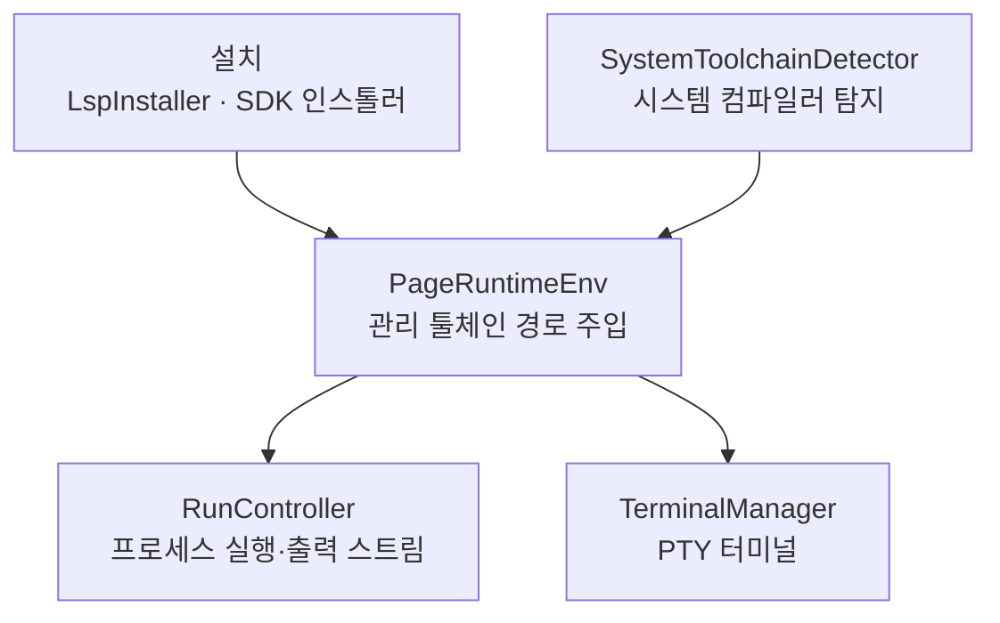

# Runtime

> `page:runtime` — 툴체인·언어 서버 설치, 프로그램 실행, 내장 터미널. IDE가 코드를 실제로 돌리는 데 필요한 바깥세상 전부

에디터가 코드를 보여 준다면, 이 모듈은 그 코드를 돌린다. 언어 서버와 SDK를 내려받아 설치하고, 실행 구성으로 프로그램을 띄워 출력을 스트리밍하고, PTY 기반 내장 터미널을 제공한다. 그 과정에서 관리 툴체인의 경로를 실행 환경에 얹어 준다.

> English: [main_en.md](https://monkshark.github.io/page-ide/#modules/runtime/main_en.md)

---

## 구성



| 층 | 역할 |
|---|---|
| 설치 | `LspInstaller`와 언어 서버·SDK 인스톨러들 — 서버와 툴체인을 내려받아 `~/.page-ide` 아래 설치 |
| 환경 | `PageRuntimeEnv` — 관리 툴체인의 bin·env를 실행 환경에 주입 |
| 실행 | `RunController`·`RunConfig` — 실행 구성으로 프로세스를 띄우고 출력을 스트리밍 |
| 터미널 | `TerminalManager`·`TerminalSession`·`AnsiParser` — pty4j 기반 내장 터미널 |
| 탐지 | `SystemToolchainDetector` — 시스템에 이미 있는 컴파일러 찾기 |

---

## 설치 — 서버와 툴체인

`LspInstaller`는 언어 서버 설치의 공통 인터페이스다.

```kotlin
interface LspInstaller {
    val languageId: String
    val precheck: Precheck
    fun isInstalled(): Boolean
    fun executable(): Path?
    fun install(version: String?, onProgress: (Progress) -> Unit)
}
```

`install`은 다운로드·압축 해제·완료·실패를 `Progress`로 흘려, UI가 진행률을 그린다. 설치물은 `~/.page-ide/lsp` 아래 언어·버전별로 정리된다. 구현체는 KLS(Kotlin)·JDT-LS(Java)·gopls·Metals·rust-analyzer·HLS·F# 등 언어별로 있다.

언어 서버뿐 아니라 SDK·툴체인 인스톨러도 여기 산다. JDK·Node·Python·Go·Rust·Dart·Flutter·.NET·Swift·C++(LLVM/MinGW)·Ruby, 그리고 Windows SDK까지. 시스템에 이미 설치된 컴파일러는 `SystemToolchainDetector`가 MSVC·clang·gcc·Xcode를 탐지해, 굳이 다시 받지 않도록 한다.

---

## PageRuntimeEnv — 실행 환경 주입

관리 툴체인은 사용자의 `PATH`에 없다. `PageRuntimeEnv`는 프로그램을 띄우기 직전, 설치된 툴체인들의 bin 디렉터리를 `PATH` 앞에 붙이고 `JAVA_HOME`·`GOROOT`·`DOTNET_ROOT`·`SDKROOT` 같은 환경 변수를 채운다. 그래야 관리 JDK로 빌드하고 관리 Go로 실행하는 흐름이 이어진다.

Windows에서는 대소문자만 다른 중복 환경 변수를 하나로 접고(`normalizeForLaunch`), MinGW용 clangd 설정을 자동 생성한다. Java처럼 특정 버전 이상을 요구하는 백엔드에는 `pinJavaRuntime(minMajor = 21)`으로 관리 JDK나 시스템 JDK 중 조건을 만족하는 것을 골라 고정한다.

---

## RunController — 프로그램 실행

`RunConfig`는 하나의 실행 구성이다 — 명령·인자·작업 디렉터리·환경, 그리고 선택적 prelaunch 빌드 단계. `RunController`는 이 구성으로 프로세스를 띄우고 stdout·stderr를 8KB 청크로 읽어 `RunEvent`(Started·Stdout·Stderr·Exited·Failed)로 흘린다.

prelaunch가 있으면 본 실행 전에 빌드를 돌리는데, `BuildCache`가 입력이 안 바뀌었다고 판정하면 재빌드를 건너뛴다. 실행 환경은 `PageRuntimeEnv`가 주입한 뒤 구성의 `env`를 덧씌운다. 여러 구성과 활성 선택은 `RunConfigsState`가 관리한다.

---

## TerminalManager — 내장 터미널

터미널은 흉내가 아니라 진짜 PTY다. `TerminalSession`은 pty4j `PtyProcess`로 셸을 띄우고, `TerminalManager`가 탭 여러 개를 관리한다. 셸은 OS별로 탐지한다 — PowerShell·CMD·Git Bash·WSL(Windows), bash·zsh·sh(그 외). `TerminalBuffer`·`TerminalGrid`가 화면 격자를, `AnsiParser`가 ANSI 이스케이프를 해석해 색과 커서를 재현한다.

---

- [목차로 돌아가기](https://monkshark.github.io/page-ide/#README_kr.md)
