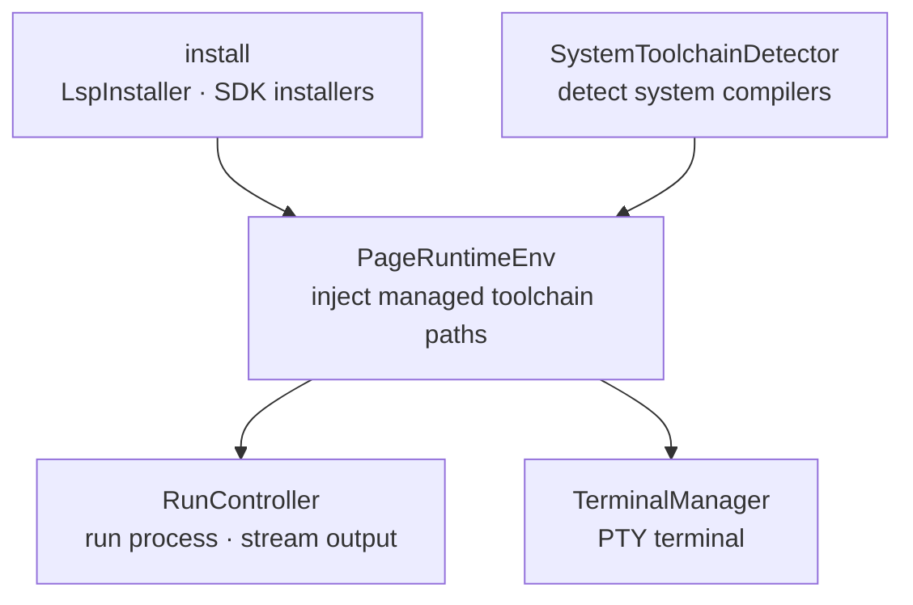

# Runtime

> `page:runtime` — toolchain and language-server installation, program execution, and an embedded terminal. Everything from the outside world the IDE needs to actually run code

If the editor shows the code, this module runs it. It downloads and installs language servers and SDKs, launches programs from a run configuration and streams their output, and provides a PTY-backed embedded terminal. Along the way it layers managed-toolchain paths onto the execution environment.

> 한국어: [main.md](https://monkshark.github.io/page-ide/#modules/runtime/main.md)

---

## Structure



| Layer | Role |
|---|---|
| Install | `LspInstaller` and the language-server / SDK installers — download servers and toolchains into `~/.page-ide` |
| Environment | `PageRuntimeEnv` — inject managed-toolchain bin/env into the run environment |
| Execution | `RunController` · `RunConfig` — launch a process from a run config and stream output |
| Terminal | `TerminalManager` · `TerminalSession` · `AnsiParser` — pty4j-backed embedded terminal |
| Detection | `SystemToolchainDetector` — find compilers already on the system |

---

## Install — servers and toolchains

`LspInstaller` is the shared interface for installing a language server.

```kotlin
interface LspInstaller {
    val languageId: String
    val precheck: Precheck
    fun isInstalled(): Boolean
    fun executable(): Path?
    fun install(version: String?, onProgress: (Progress) -> Unit)
}
```

`install` streams download, extract, done, and failure as `Progress`, so the UI can draw progress. Installed artifacts are organized under `~/.page-ide/lsp` by language and version. Implementations exist per language — KLS (Kotlin), JDT-LS (Java), gopls, Metals, rust-analyzer, HLS, F#, and more.

Beyond language servers, SDK and toolchain installers live here too: JDK, Node, Python, Go, Rust, Dart, Flutter, .NET, Swift, C++ (LLVM/MinGW), Ruby, and even the Windows SDK. Compilers already installed on the system are detected by `SystemToolchainDetector` — MSVC, clang, gcc, Xcode — so they need not be downloaded again.

---

## PageRuntimeEnv — injecting the run environment

Managed toolchains are not on the user's `PATH`. Just before launching a program, `PageRuntimeEnv` prepends the bin directories of installed toolchains to `PATH` and fills environment variables like `JAVA_HOME`, `GOROOT`, `DOTNET_ROOT`, and `SDKROOT`. That is what makes building with the managed JDK and running with managed Go hold together.

On Windows it collapses environment variables that differ only in case (`normalizeForLaunch`) and auto-generates a clangd config for MinGW. For backends that require a minimum version, like Java, `pinJavaRuntime(minMajor = 21)` selects and pins a managed or system JDK that satisfies the constraint.

---

## RunController — running programs

`RunConfig` is one run configuration — command, args, working directory, environment, and an optional prelaunch build step. `RunController` launches a process from it and reads stdout/stderr in 8 KB chunks, emitting them as `RunEvent` (Started · Stdout · Stderr · Exited · Failed).

When a prelaunch step is present, it runs a build before the main run; if `BuildCache` judges the inputs unchanged, the rebuild is skipped. The run environment is injected by `PageRuntimeEnv` and then overlaid with the config's own `env`. Multiple configs and the active selection are managed by `RunConfigsState`.

---

## TerminalManager — the embedded terminal

The terminal is a real PTY, not an imitation. `TerminalSession` spawns a shell via pty4j `PtyProcess`, and `TerminalManager` manages multiple tabs. Shells are detected per OS — PowerShell, CMD, Git Bash, WSL (Windows); bash, zsh, sh (otherwise). `TerminalBuffer` · `TerminalGrid` hold the screen grid, and `AnsiParser` interprets ANSI escapes to reproduce color and cursor.

---

- [Back to index](https://monkshark.github.io/page-ide/#README_en.md)
