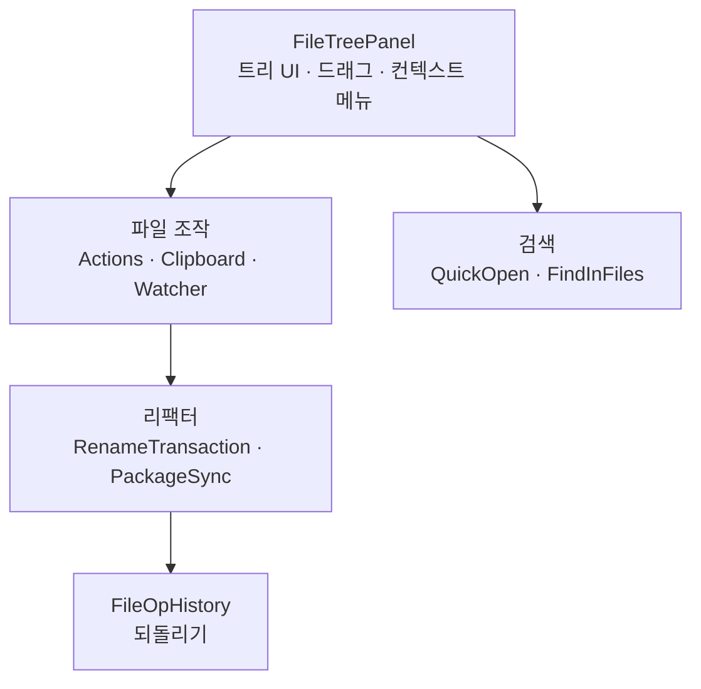

# Workspace

> `page:workspace` — 파일 트리, 파일 조작, 이름 변경 리팩터, 프로젝트 검색. 워크스페이스를 다루는 손

에디터가 한 파일을 다룬다면, 이 모듈은 프로젝트 전체를 다룬다. 좌측 파일 트리와 드래그, 파일 생성·삭제·이동, 이동 시 Kotlin 패키지·import를 따라 고치는 리팩터, 그리고 빠른 열기·전체 검색 다이얼로그가 여기 산다.

> English: [main_en.md](https://monkshark.github.io/page-ide/#modules/workspace/main_en.md)

---

## 구성

| 층 | 역할 |
|---|---|
| 트리 | `FileTreePanel`·`TreeRow`와 드래그(`TreeDrag*`)·선택·클립보드·감시 |
| 조작 | `FileTreeActions`·`FileTreeClipboard`·`FileTreeWatcher` — 생성·삭제·복사·외부 변경 감지 |
| 리팩터 | `RenameTransaction`·`FolderPackageRename`·`FileSymbolRename`·`sync/PackageSyncEngine` |
| 검색 | `QuickOpenDialog`·`FindInFilesDialog`·`SearchBar` |
| 편집 보조 | `KdocContinuation`·`CommentKeywordCompletion`·`TodoMultiKeyword`·`EditorScrollMemory` |

---

## 파일 트리

`FileTreePanel`은 좌측 사이드바 트리를 그리는 Compose 컴포저블이다. 행 렌더(`TreeRow`), 선택(`FileTreeSelection`), 클립보드(`FileTreeClipboard`), 컨텍스트 메뉴가 붙는다. 드래그는 트리 안 재배치와 트리 밖으로의 내보내기를 모두 다루며, `TreeDragController`·`TreeDragGestures`·`TreeOutboundTransferable`로 나뉜다. 외부에서 파일이 바뀌면 `FileTreeWatcher`가 감지해 트리를 갱신한다. 워크스페이스별 설정(팔레트 등)은 `WorkspaceStore`가 `workspace.json`으로 저장한다.

---

## 리팩터 — 이동이 부수는 것을 고친다

폴더나 파일을 옮기면 두 가지가 깨진다. 이동 자체가 중간에 실패할 수 있고, Kotlin이라면 패키지 선언과 import가 어긋난다. 이 모듈은 둘 다 다룬다.

`RenameTransaction`은 이동을 크래시에 안전하게 만든다. 복사(COPY)와 삭제(DELETE) 두 단계를 마커 파일에 기록하며 진행하고, 도중에 프로세스가 죽어도 `recover`가 마커를 읽어 재개하거나 롤백한다. 원본을 지우기 전에 반드시 대상이 온전한지 트리를 비교한다.

`PackageSyncEngine`은 이동 뒤 Kotlin 소스를 따라 고친다. 옮겨진 폴더 안 파일의 패키지 선언을 새 위치에 맞추고(`FolderPackageRename`), 프로젝트 전체에서 그 심볼을 가리키던 import를 다시 쓴다. 단일 파일 이동은 `SingleFileMovePlan`으로 자기 자신과 참조처를 함께 갱신한다. 이 모든 재작성은 `FileOpHistory`에 원본·수정본으로 남아 한 번에 되돌릴 수 있다.

---

## 검색

`QuickOpenDialog`는 프로젝트 파일을 퍼지 매칭으로 빠르게 여는 다이얼로그다. `FindInFilesDialog`는 내용 전체 검색을, `SearchBar`는 열린 문서 안 검색을 맡는다.

---

## 편집 보조

트리와 검색 외에, 타이핑을 거드는 작은 기능들이 여기 모인다. KDoc 주석 줄 이어 쓰기(`KdocContinuation`), 주석 안 키워드 완성(`CommentKeywordCompletion`), `TODO`·`FIXME` 같은 다중 키워드 인식(`TodoMultiKeyword`), 그리고 파일별 스크롤 위치 기억(`EditorScrollMemory`).

---

- [목차로 돌아가기](https://monkshark.github.io/page-ide/#README_kr.md)
