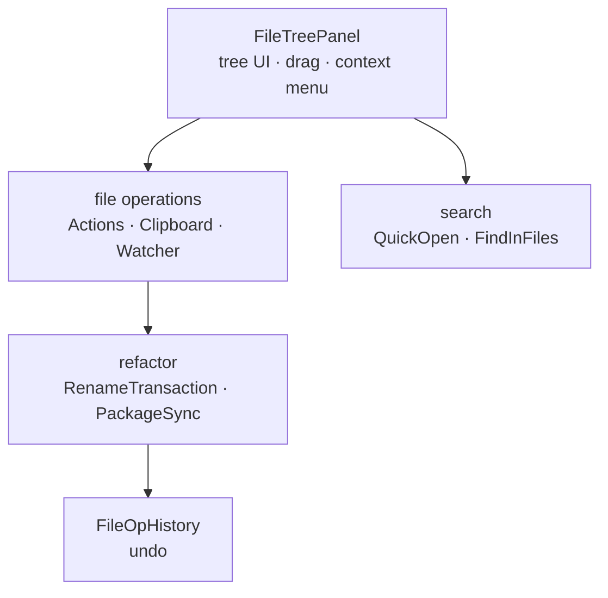

# Workspace

> `page:workspace` — the file tree, file operations, rename refactors, and project search. The hand that manipulates the workspace

If the editor handles one file, this module handles the whole project. The left-hand file tree and its drag, file create/delete/move, the refactor that follows Kotlin packages and imports on a move, and the Quick Open / find-in-files dialogs all live here.

> 한국어: [main.md](https://monkshark.github.io/page-ide/#modules/workspace/main.md)

---

## Structure

| Layer | Role |
|---|---|
| Tree | `FileTreePanel` · `TreeRow` with drag (`TreeDrag*`), selection, clipboard, watcher |
| Operations | `FileTreeActions` · `FileTreeClipboard` · `FileTreeWatcher` — create/delete/copy, external-change detection |
| Refactor | `RenameTransaction` · `FolderPackageRename` · `FileSymbolRename` · `sync/PackageSyncEngine` |
| Search | `QuickOpenDialog` · `FindInFilesDialog` · `SearchBar` |
| Editing aids | `KdocContinuation` · `CommentKeywordCompletion` · `TodoMultiKeyword` · `EditorScrollMemory` |

---

## The file tree

`FileTreePanel` is the Compose composable that draws the left sidebar tree. Row rendering (`TreeRow`), selection (`FileTreeSelection`), clipboard (`FileTreeClipboard`), and a context menu attach to it. Drag handles both in-tree reordering and export out of the tree, split across `TreeDragController` · `TreeDragGestures` · `TreeOutboundTransferable`. When files change externally, `FileTreeWatcher` detects it and refreshes the tree. Per-workspace settings (palette, etc.) are persisted by `WorkspaceStore` in `workspace.json`.

---

## Refactor — fixing what a move breaks

Moving a folder or file breaks two things: the move itself can fail midway, and for Kotlin the package declaration and imports go out of sync. This module handles both.

`RenameTransaction` makes a move crash-safe. It proceeds in two stages, copy (COPY) and delete (DELETE), recording each in a marker file; if the process dies partway, `recover` reads the marker to resume or roll back. It always compares the trees to confirm the target is intact before deleting the source.

`PackageSyncEngine` fixes up Kotlin sources after a move. It aligns the package declaration of files inside the moved folder to their new location (`FolderPackageRename`) and rewrites the imports across the whole project that pointed at those symbols. A single-file move uses a `SingleFileMovePlan` to update both the file itself and its references. All these rewrites are recorded as original/rewritten pairs in `FileOpHistory`, so they can be undone at once.

---

## Search

`QuickOpenDialog` is a fuzzy-matching dialog for opening project files fast. `FindInFilesDialog` handles full-content search, and `SearchBar` handles search within the open document.

---

## Editing aids

Beyond the tree and search, small typing helpers gather here: continuing KDoc comment lines (`KdocContinuation`), keyword completion inside comments (`CommentKeywordCompletion`), recognizing multi-keywords like `TODO` and `FIXME` (`TodoMultiKeyword`), and remembering per-file scroll position (`EditorScrollMemory`).

---

- [Back to index](https://monkshark.github.io/page-ide/#README_en.md)
